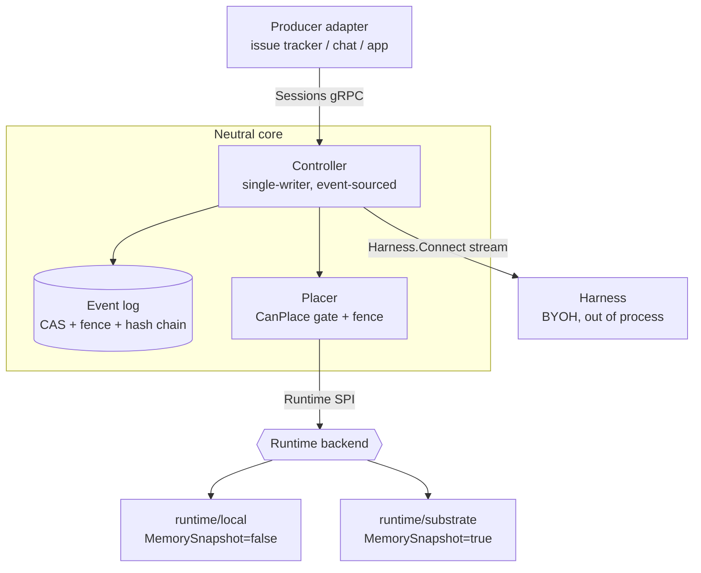

# Architecture

`agentsessions` is a **narrow waist** for durable agent sessions: one neutral core with three pluggable
seams. Producers plug in on top, compute plugs in underneath, and the harness is brought by the user —
the core knows about none of them specifically.

## The three contracts (`api/`)

One wire form (`api/*.proto`) + a Go SPI (`api/*.go`). The `Event` type is shared by the session log and
the harness stream, so what is journaled is what the harness emitted.

- **Sessions** (`api/session.proto`, served by `session/`) — the client-facing lifecycle: create, list,
  exec, suspend, resume, fork, replay. This is the seam a producer (GitHub, Foundry, a CLI) drives.
  `CreateSession` persists the session's metadata, so a session is listable and survives a restart
  before it has any events or any compute.
- **Harness** (`api/harness.proto`) — Bring-Your-Own-Harness. `Harness.Run(Start, EventSink)` drives one
  execution (turn): the harness reads `Start` (inputs, replay `History`, identity) and emits typed events
  via the sink (`MODEL_CALL`, `OUTPUT`, `TOOL_CALL`, `TOOL_RESULT`, `USAGE`). The sink hides the
  emit → wait-for-host round-trip.
- **Runtime** (`api/runtime.go`) — the compute SPI: `Create`, `Snapshot(kind)`, `Restore`, `Fork`, `Stop`,
  `Status`, `Capabilities`. Any sandbox (pod, Kata, Cloud Hypervisor, agent-substrate) implements it.

## The durable core

- **Event log** (`eventlog/` reference, `sqlitelog/` persistent) — a single-writer, append-only log with:
  - **CAS** on append (`expectedLastSeq`) — optimistic concurrency, one writer wins.
  - a **fencing token** per incarnation — a resumed incarnation mints a fresh fence; a zombie writer from
    a dead incarnation is rejected.
  - a **hash chain** — each record chains the prior hash, so tampering is detectable.
- **Session metadata** (`sqlitelog/sessions.go`) — the log records what happened; it cannot record what
  a session *is* (its project, name, configured harness and model), because none of that is an event.
  That sits in a row beside the log, written at create time so a session with no events is still
  listable. `compute_state` is a projection
  advanced in the **same transaction** that appends an event, since an event body is an opaque
  blob no query can filter on; being in-transaction is what stops it drifting from the log.
- **Canonical hash** (`canon/`) — the `content_hash` is **RFC 8785 JCS over proto3-JSON**, computed over
  the proto, not Go's `json.Marshal`. The chain is therefore language-neutral: `hack/verify_chain.py`
  (a ~30-line non-Go verifier) reproduces the Go hash for the golden vector, so any implementation or
  auditor can verify provenance.

## The controller (`controller/`)

The single-writer, event-sourced core. It drives one session's log with one incarnation (fence). Per turn
it appends the input, runs the harness, and **mediates every nondeterministic effect** through the sink so
the effect is recorded before it is observed. The determinism invariants it enforces (specified in the
companion determinism contract, exercised by `conformance/`):

- **I1 — replay never invokes the model.** On `Replay`, recorded model results are served from the
  journal; the model is called zero times.
- **I2 — reasoning continuity.** Opaque provider reasoning parts are recorded verbatim and replayed, so
  reasoning survives resume/fork on the stateless path.
- **I3 — at-most-once effect re-drive.** A crash between an effect's intent and its result is re-driven
  at most once; host-executed tools carry an idempotency key so the re-drive dedups.
- **I4 — memory-restore is not replay.** On `ResumeActor{boot:false}` the harness already holds its state
  in RAM, so `Start.History` is empty and the journal is **not** replayed into it (replaying would
  double-apply). The `REQUIRES_MEMORY_SNAPSHOT` harness carries this on its side by never reconstructing
  state from `History`.
- **I5 — byte-identical replay.** Replay reproduces the recorded events byte-for-byte (checked against the
  canonical hash), not merely equivalent output.

## Harness transport (`harnesswire/`)

The controller drives the in-process `api.Harness` interface directly, OR — for a harness in a separate
process/sandbox — over the `Harness.Connect` bidi gRPC stream. `harnesswire` bridges the two: the same
`api.Harness`/`EventSink` contract, tunneled over gRPC, so the determinism guarantees (model mediation,
record-before-effect) hold **across the process boundary** unchanged. A harness plugs in as a thin adapter
and never touches a provider SDK on the replay path.

## Placement (`placement/`)

The `Placer` wires Sessions to the `Runtime` SPI and owns the incarnation lifecycle:

- **Gate** — before provisioning compute, `CanPlace(harness.Capabilities, runtime.Capabilities)` refuses a
  harness the runtime cannot host (e.g. a `REQUIRES_MEMORY_SNAPSHOT` harness on a filesystem-only backend),
  surfaced as `ErrUnplaceable` → `FailedPrecondition`. Honest degradation, before any compute or log write.
- **Fence** — the log is the single fence authority; the Placer mints a fence and binds it to both the
  incarnation and the controller. A `Restore` mints a fresh fence so a new incarnation supersedes a zombie.
- **Dial** — the harness is reached by dialing `Incarnation.Address`. One dial path, two address forms:
  a `unix://` socket for `runtime/local`; a `host:port` (the actor's `PodIP`) for `runtime/substrate`.
- **Lifecycle map** — session `Suspend → Runtime.Snapshot`, `Resume → Runtime.Restore`, session-end
  `→ Runtime.Stop`.
- **Fork** — capability-driven. A `STATELESS_REPLAY` session replay-forks (the child cold-boots and
  the copied journal reconstructs it, parent untouched). A `REQUIRES_MEMORY_SNAPSHOT` session holds
  live state the journal cannot rebuild (I4), so the Placer checkpoints the parent via
  `Runtime.Snapshot`, records the ref in a SUSPEND event, and clones every child from it through
  `Runtime.Fork`. An N-way fan-out takes exactly one parent checkpoint, so all children branch from
  identical state.

## Runtime backends (`runtime/`)

- **`runtime/local`** — filesystem-only, serves the harness over a unix socket. `MemorySnapshot=false`, so
  `CanPlace` refuses `REQUIRES_MEMORY_SNAPSHOT` harnesses — the honest-degradation counterpart that makes
  the capability tier meaningful.
- **`runtime/substrate`** — agent-substrate (actors on pre-warmed workers, RAM+disk memory snapshots).
  `MemorySnapshot=true`. It depends only on a `ControlClient` interface **defined in the core**; the real
  ate-api adapter lives in a separate module (`integrations/substrate/`) so the core imports zero
  substrate code. See [`substrate-conformance.md`](substrate-conformance.md).

## Conformance (`conformance/`)

The CSI/CRI-style neutral checks any implementation must pass: replay reconstructs a *genuinely
nondeterministic* output, multi-turn resume-then-continue across incarnations, crash-mid-turn at-most-once
re-drive, fork equivalence (hash-tree), single-writer CAS, the cross-implementation integrity golden
vector, and the mediated-tool idempotency + rejection paths — in-process and over the `harnesswire` gRPC
transport. Passing this suite is the neutrality/leadership deliverable.
