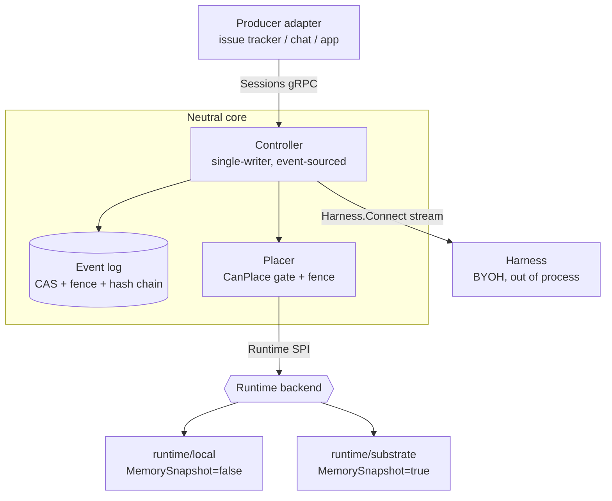
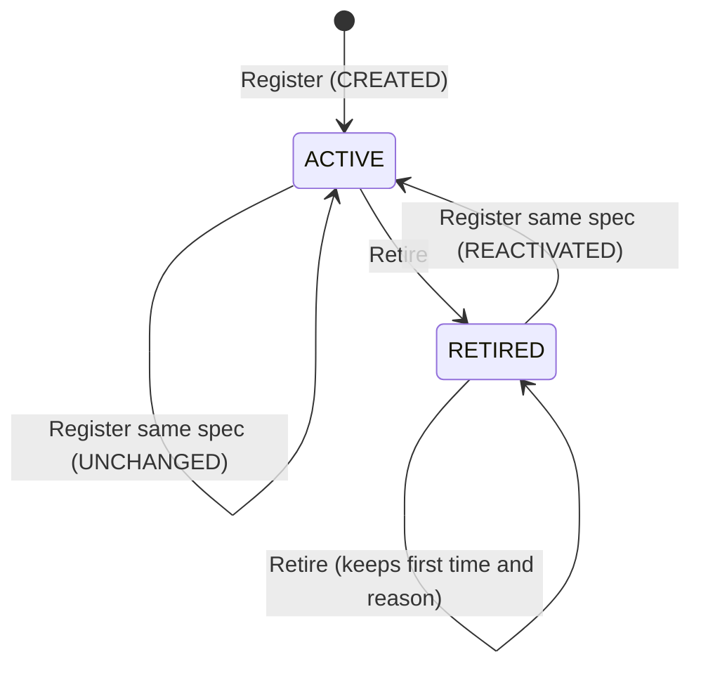

# Architecture

`agentsessions` is a **narrow waist** for durable agent sessions: one neutral core with three pluggable
seams. Producers plug in on top, compute plugs in underneath, and the harness is brought by the user —
the core knows about none of them specifically.

```mermaid
flowchart TB
  prod[Producer adapter<br/>issue tracker / chat / app] -->|Sessions gRPC| ctrl
  subgraph core[Neutral core]
    ctrl[Controller<br/>single-writer, event-sourced] --> log[(Event log<br/>CAS + fence + hash chain)]
    ctrl --> plc[Placer<br/>CanPlace gate + fence]
  end
  ctrl -->|Harness.Connect stream| har[Harness<br/>BYOH, out of process]
  plc -->|Runtime SPI| rt{{Runtime backend}}
  rt --> pod[runtime/local<br/>MemorySnapshot=false]
  rt --> sub[runtime/substrate<br/>MemorySnapshot=true]
```

## The three contracts (`api/`)

One wire form (`api/*.proto`) + a Go SPI (`api/*.go`). The `Event` type is shared by the session log and
the harness stream, so what is journaled is what the harness emitted.

- **Sessions** (`api/session.proto`, served by `session/`) — the client-facing lifecycle: create, list,
  exec, suspend, resume, fork, replay. This is the seam a producer (GitHub, Foundry, a CLI) drives.
  `CreateSession` persists the session's metadata, so a session is listable and survives a restart
  before it has any events or any compute.
- **Harness** (`api/harness.proto`) — Bring-Your-Own-Harness. `Harness.Run(Start, EventSink)` drives one
  execution (turn): the harness reads `Start` (inputs, replay `History`, identity) and emits typed events
  via the sink (`MODEL_CALL`, `OUTPUT`, `TOOL_CALL`, `TOOL_RESULT`, `USAGE`). The sink hides the
  emit → wait-for-host round-trip.
- **Runtime** (`api/runtime.go`) — the compute SPI: `Create`, `Snapshot(kind)`, `Restore`, `Fork`, `Stop`,
  `Status`, `Capabilities`. Any sandbox (pod, Kata, Cloud Hypervisor, agent-substrate) implements it.

## The durable core

- **Event log** (`eventlog/` reference, `sqlitelog/` persistent) — a single-writer, append-only log with:
  - **CAS** on append (`expectedLastSeq`) — optimistic concurrency, one writer wins.
  - a **fencing token** per incarnation — a resumed incarnation mints a fresh fence; a zombie writer from
    a dead incarnation is rejected.
  - a **hash chain** — each record chains the prior hash, so tampering is detectable.
- **Session metadata** (`sqlitelog/sessions.go`) — the log records what happened; it cannot record what
  a session *is* (its project, name, configured harness and model), because none of that is an event.
  That sits in a row beside the log, written at create time so a session with no events is still
  listable. `compute_state` is a projection
  advanced in the **same transaction** that appends an event, since an event body is an opaque
  blob no query can filter on; being in-transaction is what stops it drifting from the log.
- **Canonical hash** (`canon/`) — the `content_hash` is **RFC 8785 JCS over proto3-JSON**, computed over
  the proto, not Go's `json.Marshal`. The chain is therefore language-neutral: `hack/verify_chain.py`
  (a ~30-line non-Go verifier) reproduces the Go hash for the golden vector, so any implementation or
  auditor can verify provenance.

## The controller (`controller/`)

The single-writer, event-sourced core. It drives one session's log with one incarnation (fence). Per turn
it appends the input, runs the harness, and **mediates every nondeterministic effect** through the sink so
the effect is recorded before it is observed. The determinism invariants it enforces (specified in the
companion determinism contract, exercised by `conformance/`):

- **I1 — replay never invokes the model.** On `Replay`, recorded model results are served from the
  journal; the model is called zero times.
- **I2 — reasoning continuity.** Opaque provider reasoning parts are recorded verbatim and replayed, so
  reasoning survives resume/fork on the stateless path.
- **I3 — at-most-once effect re-drive.** A crash between an effect's intent and its result is re-driven
  at most once; host-executed tools carry an idempotency key so the re-drive dedups. A model call cut
  after `MODEL_CALL`, when that call is the turn's last recorded effect, is re-invoked on `Resume`
  when the harness re-issues the same input hash, and its completion is recorded against that call.
  Each cut costs at most one extra provider call within one host, where the per-session guard
  serializes `Exec`, `Suspend` and `Resume`; the bound does not hold across hosts sharing a journal. A
  recovering call that fails is itself a cut, and the next `Resume` re-drives it again. A fork at a
  `MODEL_CALL` costs one provider call when the child resumes. This applies to journals with execution IDs; a v0.1.2 journal
  without them is not re-driven and `Resume` still fails with "recorded completion missing".
- **I4 — memory-restore is not replay.** On `ResumeActor{boot:false}` the harness already holds its state
  in RAM, so `Start.History` is empty and the journal is **not** replayed into it (replaying would
  double-apply). The `REQUIRES_MEMORY_SNAPSHOT` harness carries this on its side by never reconstructing
  state from `History`.
- **I5 — byte-identical replay.** Replay reproduces the recorded events byte-for-byte (checked against the
  canonical hash), not merely equivalent output.

## Harness transport (`harnesswire/`)

The controller drives the in-process `api.Harness` interface directly, OR — for a harness in a separate
process/sandbox — over the `Harness.Connect` bidi gRPC stream. `harnesswire` bridges the two: the same
`api.Harness`/`EventSink` contract, tunneled over gRPC, so the determinism guarantees (model mediation,
record-before-effect) hold **across the process boundary** unchanged. A harness plugs in as a thin adapter
and never touches a provider SDK on the replay path.

## Placement (`placement/`)

The `Placer` wires Sessions to the `Runtime` SPI and owns the incarnation lifecycle:

- **Gate** — before provisioning compute, `CanPlace(harness.Capabilities, runtime.Capabilities)` refuses a
  harness the runtime cannot host (e.g. a `REQUIRES_MEMORY_SNAPSHOT` harness on a filesystem-only backend),
  surfaced as `ErrUnplaceable` → `FailedPrecondition`. Honest degradation, before any compute or log write.
- **Fence** — the log is the single fence authority; the Placer mints a fence and binds it to both the
  incarnation and the controller. A `Restore` mints a fresh fence so a new incarnation supersedes a zombie.
- **Dial** — the harness is reached by dialing `Incarnation.Address`. One dial path, two address forms:
  a `unix://` socket for `runtime/local`; a `host:port` (the actor's `PodIP`) for `runtime/substrate`.
- **Lifecycle map** — session `Suspend → Runtime.Snapshot`, `Resume → Runtime.Restore`, session-end
  `→ Runtime.Stop`.
- **Fork** — capability-driven. A `STATELESS_REPLAY` session replay-forks (the child cold-boots and
  the copied journal reconstructs it, parent untouched). A `REQUIRES_MEMORY_SNAPSHOT` session holds
  live state the journal cannot rebuild (I4), so the Placer checkpoints the parent via
  `Runtime.Snapshot`, records the ref in a SUSPEND event, and clones every child from it through
  `Runtime.Fork`. An N-way fan-out takes exactly one parent checkpoint, so all children branch from
  identical state.

## Harness registry (`session/harness_registry.go`)

`placement.Registry` maps a harness name to the Placer that runs it. Its entries come from two
sources:

- **Static** harnesses are built into the host or configured when it starts (the built-in `echo` and
  `chat`, and each `agentsessionsd --harness name=address`). They are never stored, always active,
  and read-only. Their names, plus any reserved built-in name the host is not serving right now,
  cannot be registered.
- **Registered** harnesses are added at runtime through the `HarnessRegistry` API
  (`api/harness_registry.proto`) and stored in the `harnesses` table of the journal database
  (schema version 2). The host loads every stored registration at startup, retired ones included.

Several hosts can share one journal, and their static names can differ. A name must not be static on
one and registered on another: the registered harness's sessions would run on the static one, and
retiring it would refuse new sessions on the static one. Four checks keep the two apart:

- At startup a host records its static and reserved names in the `reserved_harness_names` table, in
  one transaction with a check that none of them is registered. `NewHarnessRegistry` does this, and
  so do `agentsessionsd` and embedded `agentctl`, which do not serve the registry
  (`session.ReserveStaticHarnessNames`). A host refuses to start if one of its names is registered.
- The migration to schema version 2 reserves every harness name a version 1 journal uses, in the
  transaction that creates the table: each session's harness and each harness recorded on an
  `EXECUTION_START` marker, since a turn can override the session's harness and Resume re-runs a
  pending turn on the name it recorded. All of them were static, and the host that migrates the
  journal may not serve them.
- `RegisterHarness` refuses a reserved name with `ALREADY_EXISTS`, checked in its own transaction, so
  a host that is already running keeps its names.
- A host that did not reserve its names fails closed: creating or routing a session on a static name
  that has a registration row is `FAILED_PRECONDITION`.

Reservations are never released, because the store cannot tell whether another host still serves the
name.

A registration is immutable. Its identity is the name plus `spec_digest`, a SHA-256 over the RFC 8785
form of the spec's proto3-JSON, the same canonical form the journal hashes.

```mermaid
stateDiagram-v2
  [*] --> ACTIVE: Register (CREATED)
  ACTIVE --> ACTIVE: Register same spec (UNCHANGED)
  ACTIVE --> RETIRED: Retire
  RETIRED --> RETIRED: Retire (keeps first time and reason)
  RETIRED --> ACTIVE: Register same spec (REACTIVATED)
```

- A different spec under a taken name is `ALREADY_EXISTS`; a new spec needs a new name.
- **Retire refuses new sessions only.** The check runs in the same transaction as the session insert,
  so once `RetireHarness` returns no new session can land on the harness. Existing sessions keep
  `Exec`, `Suspend`, `Resume` and `Fork`; fork children inherit the harness.
- **Registered harnesses pin their sessions.** `ExecRequest.harness` that differs from the session's
  harness is `FAILED_PRECONDITION` when either harness is registered, whether or not this host has
  loaded it, so no session can run turns on a registered harness it was not created on, retired or
  not. `Resume` of an interrupted turn recorded on another harness applies the same rule, also when
  the name was registered after the turn was recorded. Overrides that involve no registered harness
  keep working as before.
- **Recovery uses the recorded identity, not the registry's state.** Each turn's `EXECUTION_START`
  records the registry name and the harness's advertised `Descriptor.Version`, and `Resume` of an
  interrupted turn routes to that name, where the controller requires the recorded version (see
  [concepts.md](concepts.md)). A registration is never replaced or removed, and retiring one leaves
  it loaded, so a recorded name keeps resolving to the same `spec_digest`. The registry adds no
  version check of its own: `spec_digest` fixes what the host dials, and the recorded version is
  the only check on what answers there.
- **One session guard per registry.** `Registry.Add` gives a registered harness's Placer the same
  session guard as the static ones, so overlapping `Exec`, `Suspend` and `Resume` on one session are
  `ABORTED` whichever of its Placers each call reaches. A `PlacerFactory` returns a new Placer for
  each call; one already used or registered elsewhere is not supported.
- **How placements are served is the host's choice.** A `PlacerFactory` turns a spec into a Placer, or
  refuses a placement the host cannot serve (`FAILED_PRECONDITION`, nothing stored). It must not dial,
  so a harness that is down does not keep the host from starting. A spec with a field or enum value
  the host does not understand is `INVALID_ARGUMENT`. For a `RemotePlacement`, `runtime/remote` is the
  backend, the same one `agentsessionsd --harness` uses.
- **`descriptor_id` is checked on every turn.** The factory builds the Placer with
  `placement.WithDescriptorID(spec.descriptor_id)`, and the registry refuses a Placer that does not
  expect exactly that id, so a factory that drops it fails closed. The Placer then refuses `Exec`,
  `Resume` and `Fork` with `FAILED_PRECONDITION` when the harness's `Describe` reports another id, at
  the same gate that applies `CanPlace`: before compute is touched or anything is journaled, and,
  for `runtime/remote`, again on the connection that runs the turn. The id is self-reported, so this
  catches an address that reaches the wrong harness, not an impostor. Empty means not checked.
- **Known limits.** The declared `capabilities` are stored, not compared with what the harness reports;
  placement still gates every turn on the live `Describe`. `descriptor_id` is not checked at
  registration, only when a call places the harness, and like the capability check it is not bound
  to the turn's `Connect` stream (see [security.md](security.md)). A registration made by another
  process sharing the database is served after this host restarts. There is no delete, because
  `DeleteSession` does not exist yet and a harness with sessions must stay resolvable.

The registry is an admin API and `agentsessionsd` does not serve it. It is wired in-process only, for
tests and Go embedders; see [security.md](security.md).

## Runtime backends (`runtime/`)

- **`runtime/local`** — filesystem-only, serves the harness over a unix socket. `MemorySnapshot=false`, so
  `CanPlace` refuses `REQUIRES_MEMORY_SNAPSHOT` harnesses — the honest-degradation counterpart that makes
  the capability tier meaningful.
- **`runtime/remote`** — attaches to a harness already running at a given address instead of
  provisioning one, so a harness is registered by configuration rather than compiled into the
  server. It asks the harness to `Describe` itself, so `CanPlace` gates on the tier the harness
  declares. `MemorySnapshot=false`, and structurally so: it does not own that process.
- **`runtime/substrate`** — agent-substrate (actors on pre-warmed workers, RAM+disk memory snapshots).
  `MemorySnapshot=true`. It depends only on a `ControlClient` interface **defined in the core**; the real
  ate-api adapter lives in a separate module (`integrations/substrate/`) so the core imports zero
  substrate code. See [`substrate-conformance.md`](substrate-conformance.md).

## Conformance (`conformance/`)

The CSI/CRI-style neutral checks any implementation must pass: replay reconstructs a *genuinely
nondeterministic* output, multi-turn resume-then-continue across incarnations, crash-mid-turn at-most-once
re-drive, fork equivalence (hash-tree), single-writer CAS, the cross-implementation integrity golden
vector, and the mediated-tool idempotency + rejection paths — in-process and over the `harnesswire` gRPC
transport. Passing this suite is the neutrality/leadership deliverable.
