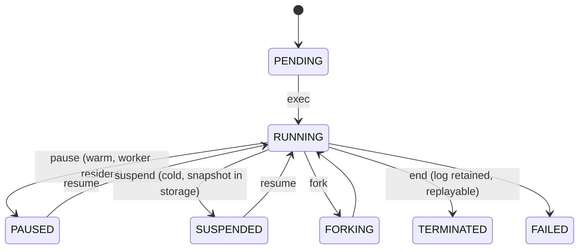
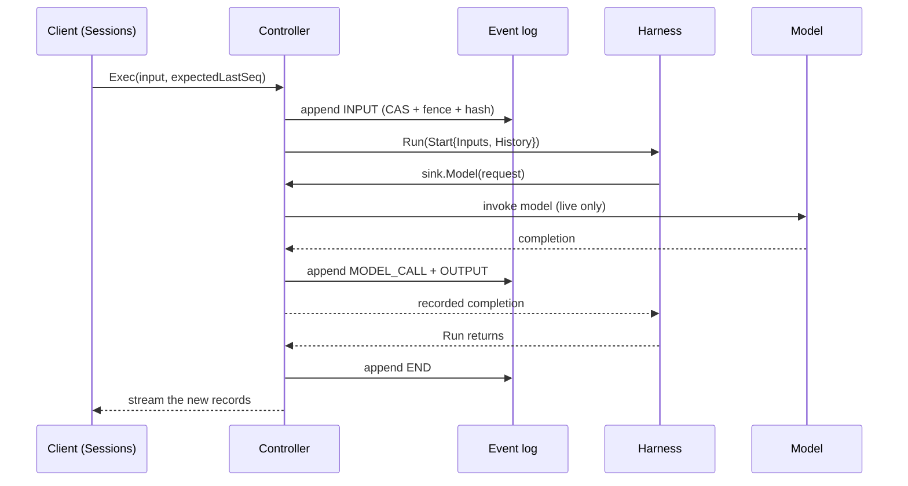

# Concepts

The mental model behind `agentsessions`: the nouns, why each exists, and how they fit together. Read
this first, then [`quickstart.md`](quickstart.md) to see them in action and [`architecture.md`](architecture.md)
for the implementation.

## The one-paragraph version

An agent session is a durable, long-running conversation between a user (or a producer like an issue
tracker) and an agent. `agentsessions` stores that session as an append-only, hash-chained event log
and drives it through a single-writer controller. Because the log is the source of truth, a session
can be killed and reconstructed byte-for-byte by replaying the log, moved between compute backends,
forked to explore alternatives, and audited by anyone. The core knows nothing about which framework
wrote the agent or which cloud runs it.

## The three seams

`agentsessions` is a narrow waist with three pluggable contracts. Producers plug in on top, compute
plugs in underneath, and the harness is brought by the user.

| Seam | Contract | Who implements it |
|---|---|---|
| **Sessions** | `api/session.proto` | The client. A producer adapter (GitHub, Foundry, a CLI) drives create / exec / suspend / resume / fork / replay. |
| **Harness** | `api/harness.proto`, `api.Harness` | The agent author. One `Run` drives one turn and streams typed events. See [`harness-authoring.md`](harness-authoring.md). |
| **Runtime** | `api/runtime.go`, `api.Runtime` | The compute backend. A pod, Kata, Cloud Hypervisor, or agent-substrate provides the sandbox. |

The rest of this document is about the nouns those seams pass around.

## Session

A session is the durable unit. It has a stable UID (for example `sess-6ff29e8d93d3a4c65f6f38bc`) and
its entire truth lives in one event log. A session is not tied to a process: the same session can run
on one incarnation now, be killed, and continue on a different one later. Its lifecycle is a single
`Phase` enum (`api/types.go`) that flattens two axes, execution and compute, into one state:

`PAUSED` is warm (still resident on a worker, instant resume). `SUSPENDED` is cold (snapshot written to
storage, the worker is freed). `TERMINATED` still keeps the log, so a finished session stays replayable.

### Metadata and listing

The log holds what happened. It does not hold what the session *is* — the project that owns it, its
display name, the configured harness and model — because none of that is an event. That lives in a
metadata row alongside the log, written by `CreateSession` before any event exists.

This is why a session that was just created, with no turns and no compute, still shows up in
`ListSessions`. A listing derived from the event table alone would drop exactly the sessions a user
just started and is waiting on.

`ListSessions` reads that row, so a listing is complete after a process restart and does not depend
on anything held in memory. It filters on an exact `project`, never a wildcard, so a caller cannot
enumerate a tenant it did not ask for. Results are newest first and paged with a cursor that carries
the last `(create time, uid)` seen, so a session created while a caller walks pages neither skips
nor duplicates a row.

Two fields are derived rather than stored:

- `last_seq` is `MAX(seq)` over the log, so the cursor a listing reports is always the log's own.
- `compute_state` is a projection maintained in the same transaction that appends an event, since an
  event body is an opaque blob no query can filter on. It records **what the log implies about
  compute**, not a live probe of the backend. Any ordinary event moves a session to `LIVE`, because
  something had to be running to produce it; `SUSPEND` and `FORK` land it `COLD`, and `RESUME`
  returns it to `LIVE`. A session that has been created but never run stays `NONE`, which is what
  makes it visible in a listing before it has any compute. `LIVE` goes stale if the process behind
  it later died. A backend that can enumerate its own incarnations is the thing that would make this
  exact; reconciling against the runtime is not implemented.

A fork inherits the parent's `project`, `harness` and `model`, because those define the workload and
a branch of a run is still that run. It does **not** inherit the parent's name. A name is a label the
caller chose for humans, and copying it makes a listing report N+1 rows that all claim to be the same
session. Synthesizing one instead (`"<parent> fork 2"`) would push a presentation convention into the
wire contract, and the counter is wrong as soon as the same parent is forked by two separate calls.
So a child is unnamed unless the caller names it with `ForkRequest.child_names`, which takes either no
entries or exactly `count` of them. Lineage is not lost by this: `parent_uid` and `fork_seq` are
stored on the child, so a caller that wants to show "branched from X" has the structured data to
build it from and does not need the server to flatten it into a string.

## Event and the typed log

The session log is a sequence of `Event`s. An event is not an opaque blob: it is typed, so provenance,
cost, audit, and tool approval are first-class rather than parsed out of text after the fact. The
`EventKind`s (`api/types.go`):

| Kind | Meaning |
|---|---|
| `INPUT` | A user or producer input message. |
| `MODEL_CALL` | A call to a model was made (records the model, params, and an input hash for the replay check). |
| `OUTPUT` | Assistant output (a delta or a full message). |
| `TOOL_CALL` / `TOOL_RESULT` | A tool invocation and its outcome. Aligned with an MCP tool call. |
| `APPROVAL_REQUEST` / `APPROVAL_RESULT` | A human or policy approval gate around a tool. |
| `USAGE` | Per-call token and cost accounting. |
| `LIFECYCLE` | A compute or session transition (`SUSPEND`, `RESUME`, `FORK`, `BASELINE`, `CANCEL`). |
| `END` | The terminal state of one execution (`COMPLETED` / `FAILED` / `CANCELED`). |
| `ERROR` | An error, mirroring a gRPC status. |

The same `Event` type is shared by the session log and the harness stream, so what a harness emits is
exactly what gets journaled. Content is carried as A2A-style `Message`s (a role plus a list of `Part`s:
text, file, structured data, or an opaque reasoning block).

## The event log: single writer, append-only, tamper-evident

The log (`eventlog/` reference in memory, `sqlitelog/` on disk) is where durability, concurrency, and
provenance all live. It has three properties stacked on an append-only sequence:

- **CAS on append.** Every append names the sequence number it expects to extend (`expectedLastSeq`).
  Two writers racing the same session: one wins, the other is rejected. This is what makes "single
  writer" enforceable rather than aspirational.
- **A fencing token per incarnation.** See [Incarnation and fence](#incarnation-and-fence).
- **A hash chain.** Each record carries `prev_hash` and a `content_hash` over its event. Change any past
  event and its hash no longer matches, and every later `prev_hash` link is now inconsistent. Tampering
  is detectable by recomputation, with no external index.

## Canonical hash and language-neutral provenance

The `content_hash` is not `json.Marshal` of a Go struct. It is **RFC 8785 JCS (JSON Canonicalization
Scheme) over the proto3-JSON form** of the event (`canon/`). Because the canonical form is defined on
the wire proto and not on any language's serializer, the chain is reproducible outside Go. A roughly
30-line Python verifier (`hack/verify_chain.py`) recomputes the exact Go hash for a golden vector and
audits a full real journal. Provenance you can only check with the original implementation is not
provenance, so this property is load-bearing.

## Incarnation and fence

An **incarnation** is one live compute instance of a session: a sandbox on some worker, with an address
where its harness listens. A session can outlive many incarnations (kill one, start another).

A **fence** is a monotonic token bound to an incarnation. The log is the single fence authority: a fresh
incarnation mints a higher fence, and the log rejects any append carrying a fence lower than the current
one. So if a supposedly-dead incarnation wakes up and tries to write (a zombie), its stale fence is
refused. Fencing plus CAS is how a session with automatic failover still has exactly one writer at any
instant.

## Resumability: replay or memory snapshot

How a harness survives suspend, resume, and fork is declared, not guessed. It is a property of the
harness (`api.Capabilities.Resumability`):

- **`STATELESS_REPLAY`** (the default). The harness keeps no durable in-process state beyond the log.
  To resume or fork, the host replays history into it (`Start.History`). This runs on any runtime,
  including a plain pod with no snapshot support. `echoagent` is the reference example.
- **`REQUIRES_MEMORY_SNAPSHOT`.** The harness holds in-process state that the log cannot reconstruct: a
  live REPL, a browser, a long-running computation. Resuming means restoring RAM, so the host only
  schedules it on a runtime that can snapshot memory. Forking means the same thing: the parent is
  checkpointed and each child is cloned from that snapshot, so a fork costs a suspend on the parent and
  is only available at HEAD. `counteragent` is the reference example.

The distinction is honest by design. A stateless-replay harness costs nothing special and goes anywhere.
A memory-snapshot harness gets a capability a plain pod structurally cannot provide, and pays for it by
being placeable only on memory-capable compute.

## Capability matching and `CanPlace`

A harness declares what it needs (`api.Capabilities`). A runtime declares what it can do
(`api.RuntimeCapabilities`, for example `MemorySnapshot`, `CoWFork`, `Attest`, `GPUState`). Before any
compute is provisioned, `CanPlace(harness, runtime)` (`controller/`) refuses a placement the runtime
cannot honor, for example a `REQUIRES_MEMORY_SNAPSHOT` harness on a filesystem-only backend. The result
is honest degradation up front (a `FailedPrecondition`), instead of resuming a session wrong and
discovering it later.

## Determinism invariants

Replay is only useful if it is exact. The controller (`controller/`) mediates every nondeterministic
effect through the harness event sink so the effect is recorded before it is observed, and the
replay-conformance suite (`conformance/`) enforces a numbered contract. The load-bearing rules:

- **I1: replay never invokes the model.** On replay the recorded model result is served from the
  journal. The model is called zero times.
- **I2: reasoning continuity.** Opaque provider reasoning parts are recorded verbatim and replayed, so
  reasoning survives resume and fork on the stateless path.
- **I3: at-most-once effect re-drive.** A crash between an effect's intent and its result is re-driven at
  most once. Host-executed tools carry an idempotency key so the re-drive dedups.
- **I4: memory-restore is not replay.** After a memory restore the harness already holds its state in
  RAM, so `Start.History` is empty and must not be replayed into it. A `REQUIRES_MEMORY_SNAPSHOT` harness
  never reconstructs state from `History` (see [`harness-authoring.md`](harness-authoring.md)).
- **I5: byte-identical replay.** Replay reproduces the recorded events byte-for-byte (checked against the
  canonical hash), not merely output that looks equivalent.

## How one turn flows

Putting it together, a single `exec` turn on a stateless-replay harness:

On **replay** the same sequence runs with one difference: at `sink.Model` the controller serves the
recorded completion from the log and never touches the model (I1). That is why a killed session comes
back byte-identically without spending a single model call.

## Glossary

| Term | One line |
|---|---|
| Session | A durable, event-sourced agent run identified by a UID. |
| Event | The typed unit of the log and the harness stream. |
| Event log | Single-writer, append-only, CAS + fence + hash chain. |
| Incarnation | One live compute instance (sandbox) of a session. |
| Fence | Monotonic token that makes single-writer enforceable across failover. |
| Canonical hash | RFC 8785 JCS over proto3-JSON, the language-neutral `content_hash`. |
| Resumability | `STATELESS_REPLAY` or `REQUIRES_MEMORY_SNAPSHOT`. |
| `CanPlace` | The gate matching a harness's needs to a runtime's capabilities. |
| Harness | The Bring-Your-Own-Harness agent behind the `api.Harness` SPI. |
| Runtime | The pluggable compute backend behind the `api.Runtime` SPI. |
| Producer | An adapter that maps an external world (issues, chat) onto sessions. |
