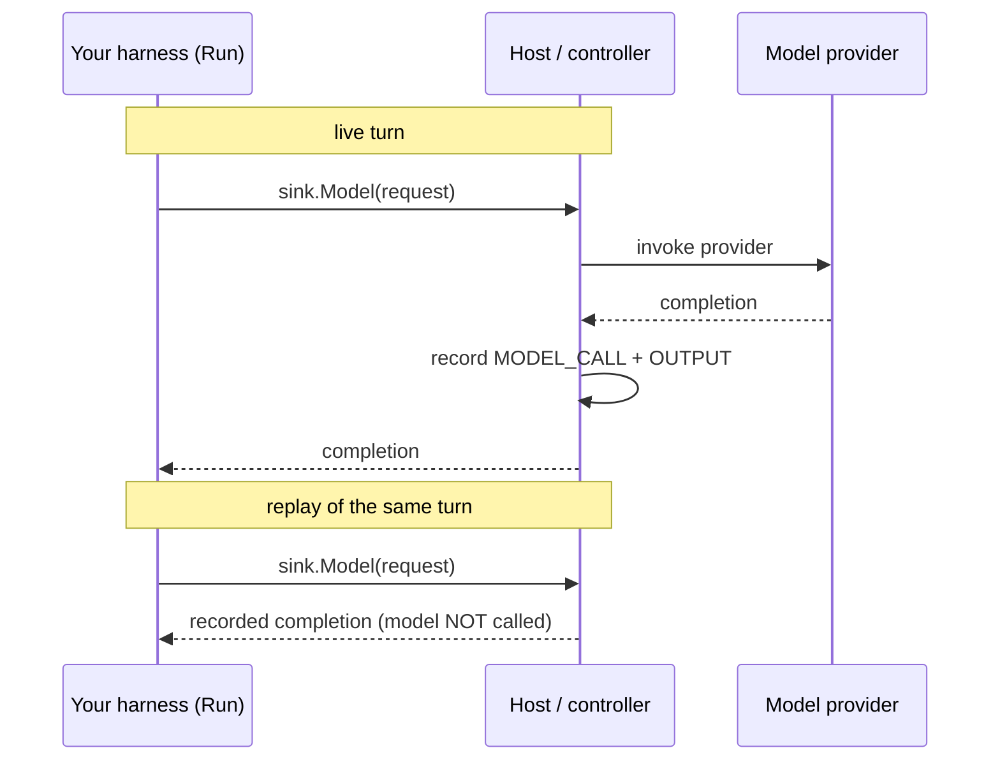

# Writing a harness

A **harness** is your agent behind the `agentsessions` Bring-Your-Own-Harness SPI. It is the one piece
you write. A Microsoft Agent Framework agent, a GitHub Copilot agent, a LangChain agent, or a custom
loop all plug in the same way: implement two methods, emit typed events through a sink, and declare what
you need from the runtime. In return you get durability, byte-identical replay, fork, suspend and resume,
and a tamper-evident provenance chain, none of which your harness has to implement.

This guide is the `api.Harness` (`api/harness.go`) contract, the rules that keep replay exact, and
three reference harnesses. Read [`concepts.md`](concepts.md) first for the nouns.

## The contract

```go
type Harness interface {
    // Describe returns the static contract, used to match the harness to a Runtime.
    Describe(ctx context.Context) (Descriptor, error)

    // Run drives exactly one execution (turn). It reads the Start, emits events via
    // sink, and returns nil on COMPLETED or an error on FAILED.
    Run(ctx context.Context, s *Start, sink EventSink) error
}
```

Two methods. `Describe` is static metadata. `Run` drives one turn. The host calls `Run` once per turn,
gives you the inputs and (on the stateless path) the history, and records everything you emit.

## Describe: declare your contract

```go
type Descriptor struct {
    ID           string
    Models       []string   // supported/required model ids (model-agnostic)
    Tools        []ToolSpec
    Capabilities Capabilities
}
```

`Capabilities` is the important part, because the host uses it to place your harness on a compatible
runtime (see [Capability matching](#capability-matching)):

```go
type Capabilities struct {
    Resumability    Resumability // STATELESS_REPLAY (default) or REQUIRES_MEMORY_SNAPSHOT
    ForkSafe        bool         // no un-replayable side effects mid-turn
    RequiresGPU     bool
    Streaming       bool
    ReasoningReplay bool         // persists opaque provider reasoning verbatim
}
```

## Run: drive one turn

The host hands you a `Start` and an `EventSink`.

```go
type Start struct {
    Config        []byte    // opaque per-execution config
    History       []Event   // replay context; EMPTY if the sandbox was memory-restored
    Inputs        []Message // new input(s); EMPTY = resume/re-drive an interrupted execution
    Identity      IdentityContext
    ResumeFromSeq int64
}
```

Two fields carry rules worth internalizing now:

- `History` is your replay context on the `STATELESS_REPLAY` path. It is **empty after a memory
  restore**, because a memory-snapshot harness already holds its state in RAM. Never rebuild in-RAM
  state from `History` (invariant I4, [below](#rule-3-choose-resumability-honestly)).
- `Inputs` is **empty when the host is re-driving an interrupted turn**. An `Exec` with no inputs means
  "continue the last execution", not "start a new one".

## The event sink

Everything your harness does that the world should see, it does through the sink (`api.EventSink`). The
SDK hides the gRPC stream, sequence numbers, and the emit-then-wait-for-host round trip.

```go
type EventSink interface {
    Model(ctx context.Context, req ModelRequest) (ModelResponse, error) // mediated model call
    Output(ctx context.Context, delta string) error                     // stream assistant output
    ToolCall(ctx context.Context, tc ToolCall) (ToolResult, error)      // host-executed tool, blocks
    Report(ctx context.Context, tr ToolResult) error                    // record a tool YOU executed
    Usage(ctx context.Context, u Usage) error                           // token/cost accounting
}
```

Every sink method takes a `context.Context`. Pass the one `Run` gave you, or a context derived from
it: that is what carries the turn's cancellation and deadline through to the provider call, so a
cancelled turn stops an in-flight completion instead of orphaning it.



`sink.Model` is the load-bearing call. Live, the host invokes the provider and records the result.
On replay, the host serves the recorded result and does not call the provider. Because the completion
always flows back through this one mediated call, **your harness never imports a provider SDK on the
replay path**, and replay is exact for free.

## The rules that keep replay exact

Five rules. Follow them and every determinism guarantee holds across process death, resume, and fork.

### Rule 1: all model calls go through `sink.Model`

Never call an LLM provider SDK directly. Route every completion through `sink.Model`. If you call a
provider directly, that call is invisible to the log, so replay cannot reproduce it and will either
diverge or re-spend the call. This single rule is why replay never invokes the model (I1).

### Rule 2: do not double-record the model completion as output

The completion returned by `sink.Model` is recorded as the turn's output by the host. Do not also send
the same content through `sink.Output`, or it lands in the log twice. Use `sink.Output` for content the
model did not produce through the mediated call (for example progress text you generate yourself).

### Rule 3: choose resumability honestly

- If your harness keeps **no durable in-process state** beyond the log, declare `STATELESS_REPLAY`. On
  resume and fork the host replays `Start.History` into you. You reconstruct from `History`. This runs on
  any runtime, including a plain pod.
- If your harness keeps **in-process state the log cannot rebuild** (a REPL, a browser, a warm process),
  declare `REQUIRES_MEMORY_SNAPSHOT`. The host schedules you only on memory-capable compute and restores
  your RAM on resume and on fork — a forked child is a clone of the parent's snapshot, not a replay. In
  this mode `Start.History` is empty after a restore, and you must **never** reconstruct state from it
  (I4). Doing so would reset or double-apply the very state the snapshot preserved.

Do not declare `REQUIRES_MEMORY_SNAPSHOT` to be safe. It restricts where you can run. Declare it only if
your state genuinely cannot be replayed.

### Rule 4: pick a tool mediation tier, and set idempotency keys

Each tool declares how it executes (`api.Mediation`):

| Tier | Who runs the tool | Use for |
|---|---|---|
| `IN_HARNESS_REPORTED` (default) | Your harness, in-sandbox. You call `sink.Report(result)`. | Fast, read-mostly tools. Reported for audit. |
| `CONTROLLER_MEDIATED` | The host / gateway. You call `sink.ToolCall(...)` and block for the result. | Tools needing central authz, policy, or audit. |
| `REQUIRES_APPROVAL` | The host, after a human or policy approval gate. | Sensitive or destructive actions. |

For any side-effecting tool, set `ToolCall.IdempotencyKey`. If a crash forces an at-most-once re-drive
(I3), the key lets the tool side dedup so the effect happens once, not twice.

### Rule 5: pass reasoning parts back verbatim

If your provider returns opaque reasoning parts, return them inside `ModelResponse.Message` unchanged and
set `Capabilities.ReasoningReplay`. The host records them verbatim and replays them, so reasoning
continuity survives resume and fork (I2) without a memory snapshot. `agentsessions` never interprets the
opaque bytes; provider specifics stay inside them.

## Reference harness 1: stateless replay (`harness/echoagent`)

The whole harness. It sends the last input to the model through the sink and lets the recorded
completion be the output. Nothing else.

```go
type Harness struct{}

func (Harness) Describe(ctx context.Context) (api.Descriptor, error) {
    return api.Descriptor{
        ID:     "echo",
        Models: []string{"echo"},
        Capabilities: api.Capabilities{
            Resumability: api.ResumabilityStatelessReplay,
            ForkSafe:     true,
        },
    }, nil
}

func (Harness) Run(ctx context.Context, s *api.Start, sink api.EventSink) error {
    text := ""
    if n := len(s.Inputs); n > 0 {
        text = s.Inputs[n-1].Text()
    }
    _, err := sink.Model(ctx, api.ModelRequest{
        Model:    "echo",
        Messages: []api.Message{*api.TextMessage("user", text)},
    })
    return err
}
```

Notes:

- It declares `STATELESS_REPLAY` and `ForkSafe`, so it runs on any runtime and forks by replay.
- The only nondeterministic operation is `sink.Model`. That is what makes replay trivially exact: the
  host records the completion live and serves it from the journal on replay.
- It does not call `sink.Output`. The mediated completion is already recorded as the output (Rule 2).

## Reference harness 2: conversational chat (`harness/chatagent`)

`chatagent.Harness{Model: "your-model-id"}` is a small, text-only `api.Harness` with descriptor ID
`chat`. It declares `STATELESS_REPLAY` and `ForkSafe`, retaining no durable in-memory state.
Each turn it retains the messages from prior `EVENT_INPUT` and `EVENT_OUTPUT` events in
`Start.History`, in journal order, then appends every current `Start.Inputs` message exactly once.
Audit and lifecycle events (`MODEL_CALL`, `END`, `ERROR`, `LIFECYCLE`, and other non-conversation
events) do not enter model context.

The harness calls only `EventSink.Model` with its configured model ID and this conversation.
The host supplies the model implementation and records the completion; the harness does not
import a provider SDK or re-emit the completion through `sink.Output`. It has no tools, provider
adapter, model routing, or streaming logic.

**The full recorded conversation is sent on every turn.** This is a simple reference context
policy, not a scalable context-window strategy: there is no truncation or summarization, and long
conversations can exceed a model's context window.

### Run chat through the reference server

Build both binaries from the repository root:

```bash
go build -o ./bin/agentsessionsd ./cmd/agentsessionsd
go build -o ./bin/agentctl ./cmd/agentctl
```

Ollama is one compatible host-side endpoint, not a dependency of `chatagent`. With Ollama already
running locally and `gemma3:1b` available (`ollama pull gemma3:1b`), start the server in one terminal:

```bash
./bin/agentsessionsd \
  --model gemma3:1b \
  --model-base-url http://127.0.0.1:11434/v1
```

In another terminal, create a chat session and run two turns:

```bash
SID=$(./bin/agentctl create --server 127.0.0.1:8080 --harness chat)
./bin/agentctl exec --server 127.0.0.1:8080 --session "$SID" --input "What is a prime number?"
./bin/agentctl exec --server 127.0.0.1:8080 --session "$SID" --input "Give me three examples."
```

Or create and run the first turn in one call:

```bash
./bin/agentctl exec --server 127.0.0.1:8080 --harness chat --input "What is a prime number?"
```

That prints `session <uid>`; use that UID with `--session` for subsequent turns. The Go client
already supports the same selection with `client.ExecOptions{Harness: "chat", Inputs: ...}`.
On an existing session, `exec --harness` overrides the harness for that turn only; omitting it
uses the stored session harness.

With `--model` set, `agentsessionsd` registers `chat` alongside `echo`, each on its own
`runtime/local.Backend`, using the configured host-side `model/openai` client. Echo remains the
registry default. Without `--model`, only echo is registered and the built-in echo model still
provides the zero-configuration quickstart. The embedded `agentctl` server remains echo-only,
so chat requires `--server`. The reference server is plaintext and unauthenticated; keep it on
a trusted interface (see [security.md](security.md)).

Two current limitations matter:

- `Session.model` is stored metadata, not effective model selection
  ([aramase/agentsessions#31](https://github.com/aramase/agentsessions/issues/31)).
  The example deliberately omits `agentctl create --model`; `agentsessionsd --model` configures
  the model ID requested by chat for all its sessions.
- Controller re-execution of a history-aware harness is blocked by the turn-boundary bug in
  [aramase/agentsessions#41](https://github.com/aramase/agentsessions/issues/41).
  Chat's controller-level replay coverage must wait for that fix. Live multi-turn execution and
  `agentctl replay` (which only reads committed journal records via the Sessions API) are separate
  from `Controller.Replay`.

### Package chat for a remote runtime

The existing `cmd/harnessnode` binary can serve the same harness over `harnesswire`:

```bash
go build -o ./bin/harnessnode ./cmd/harnessnode
HARNESS_KIND=chat HARNESS_MODEL=gemma3:1b \
  HARNESS_ADDR=127.0.0.1:8082 HARNESS_READYZ=127.0.0.1:8083 ./bin/harnessnode
```

This starts only the harness endpoint and readiness probe, not a Sessions server. A remote-runtime
host must place and connect to it and supply the model implementation. `HARNESS_MODEL` is required
for chat and is validated before listeners open. Echo remains the default; counter remains the
memory-snapshot example.

Only the model ID belongs in the harness environment. Keep provider URLs and credentials on the
host. Repository-owned hosts can reuse `internal/modelconfig.New` with an explicit `Config`
(`Model`, `BaseURL`, `Path`, `AuthHeader`, `APIKey`), then pass the returned client's `Model` and
`StreamModel` methods to placement. `Authorization` uses a bearer credential; other header names
carry the raw key. An empty header or key sends no credential.

The constructor does not read environment variables or choose a fallback model. `agentsessionsd`
still owns its flags, `MODEL_API_KEY` / `OPENAI_API_KEY` precedence, logging, and built-in echo
fallback. This shared construction helper adds no provider routing or dynamic registration.

## Reference harness 3: memory snapshot (`harness/counteragent`)

The counterpart. Its state is an in-RAM integer that the log cannot reconstruct, so it needs a memory
snapshot and demonstrates Rule 3 and I4.

```go
type Harness struct {
    mu    sync.Mutex
    count int
}

func (h *Harness) Describe(ctx context.Context) (api.Descriptor, error) {
    return api.Descriptor{
        ID: "counter",
        Capabilities: api.Capabilities{
            Resumability: api.ResumabilityRequiresMemorySnapshot,
            ForkSafe:     false,
        },
    }, nil
}

func (h *Harness) Run(ctx context.Context, s *api.Start, sink api.EventSink) error {
    h.mu.Lock()
    h.count++
    n := h.count
    h.mu.Unlock()
    return sink.Output(ctx, strconv.Itoa(n))
}
```

The critical detail is what `Run` does **not** do: it never reads `s.History`. The count is pure process
RAM. It is `0` on a fresh boot and the snapshot-restored value after a memory restore. If the harness
reset to zero on an empty `History`, or replayed `History` to rebuild the count, it would destroy the
continuity the snapshot preserved. That a fresh boot starts at `0` (state lost, not replayed) is exactly
why this harness needs a memory snapshot at all, and why a filesystem-only runtime must refuse it.

## Running out of process

Your harness usually runs in a separate process or sandbox, not in the host. The controller drives the
same `api.Harness` contract over the `Harness.Connect` bidi gRPC stream, and `harnesswire/` bridges the
two. The `EventSink` you code against is identical whether you are in-process or across the wire, so
model mediation and record-before-effect hold across the process boundary unchanged. You never see the
gRPC stream or sequence numbers; the SDK handles them.

## Capability matching

When you declare `Capabilities`, the host matches them against the runtime's `RuntimeCapabilities`
before provisioning compute, via `CanPlace` (`controller/`). A `REQUIRES_MEMORY_SNAPSHOT` harness on a
filesystem-only backend is refused up front with a `FailedPrecondition`, not resumed incorrectly later.
So declaring capabilities accurately is not paperwork: it is what routes your harness to compute that can
actually honor it, and what makes the system degrade honestly instead of silently doing the wrong thing.

## Checklist

- [ ] `Describe` returns a stable `ID` and accurate `Capabilities`.
- [ ] Every model call goes through `sink.Model`, never a provider SDK directly.
- [ ] You do not re-emit the mediated completion through `sink.Output`.
- [ ] Resumability matches reality: replayable state is `STATELESS_REPLAY`; genuine in-RAM state is
      `REQUIRES_MEMORY_SNAPSHOT` and never rebuilt from `History`.
- [ ] Side-effecting tools set an `IdempotencyKey` and use the right mediation tier.
- [ ] Opaque reasoning parts are returned verbatim, with `ReasoningReplay` set.
