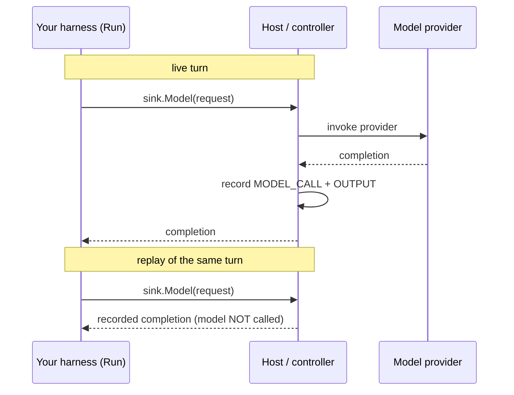

# Writing a harness

A **harness** is your agent behind the `agentsessions` Bring-Your-Own-Harness SPI. It is the one piece
you write. A Microsoft Agent Framework agent, a GitHub Copilot agent, a LangChain agent, or a custom
loop all plug in the same way: implement two methods, emit typed events through a sink, and declare what
you need from the runtime. In return you get durability, byte-identical replay, fork, suspend and resume,
and a tamper-evident provenance chain, none of which your harness has to implement.

This guide is the `api.Harness` (`api/harness.go`) contract, the rules that keep replay exact, and
three reference harnesses. Read [`concepts.md`](concepts.md) first for the nouns.

## The contract

```go
type Harness interface {
    // Describe returns the static contract, used to match the harness to a Runtime.
    Describe(ctx context.Context) (Descriptor, error)

    // Run drives exactly one execution (turn). It reads the Start, emits events via
    // sink, and returns nil on COMPLETED or an error on FAILED.
    Run(ctx context.Context, s *Start, sink EventSink) error
}
```

Two methods. `Describe` is static metadata. `Run` drives one turn. The host calls `Run` once per turn,
gives you the inputs and (on the stateless path) the history, and records everything you emit.

## Describe: declare your contract

```go
type Descriptor struct {
    ID           string
    Version      string     // optional, opaque replay-compatibility version
    Models       []string   // supported/required model ids (model-agnostic)
    Tools        []ToolSpec
    Capabilities Capabilities
}
```

`Version` is an optional, stable token owned by the harness author. Change it when deterministic
execution or config interpretation changes, not for an unrelated host release. Hosts record the
advertised value, including empty, in `EXECUTION_START`. Known recorded versions must match exactly
on controller replay/interrupted recovery; served empty is a mismatch for a known version.
Unversioned harnesses remain supported, and older markers without a version have no version guard.
The reference echo, chat and counter harnesses advertise `"1"`. This is not a configuration digest
or authentication: it is what the harness advertises. Remote `Describe` is not bound to `Connect`,
so the existing operator-controlled endpoint/replica limitation still applies.

The recorded executing name is the host's resolved registry name, not necessarily `Descriptor.ID`.
A per-turn override is resumed through that same registry entry (backend/model/executor); removing
it or serving a different known version yields `FAILED_PRECONDITION`. Missing legacy names fall
back to session metadata. Completed Resume and other lifecycle routing are unchanged. Raw
`Sessions.Replay` remains readable even when the recorded implementation is not served.

`Capabilities` is the important part, because the host uses it to place your harness on a compatible
runtime (see [Capability matching](#capability-matching)):

```go
type Capabilities struct {
    Resumability    Resumability // STATELESS_REPLAY (default) or REQUIRES_MEMORY_SNAPSHOT
    ForkSafe        bool         // no un-replayable side effects mid-turn
    RequiresGPU     bool
    Streaming       bool
    ReasoningReplay bool         // persists opaque provider reasoning verbatim
}
```

## Run: drive one turn

The host hands you a `Start` and an `EventSink`.

```go
type Start struct {
    Config        []byte    // opaque per-execution config
    History       []Event   // replay context; EMPTY if the sandbox was memory-restored
    Inputs        []Message // invocation inputs, restored from the journal on controller recovery
    Identity      IdentityContext
    ResumeFromSeq int64
}
```

Two fields carry rules worth internalizing now:

- `History` is your replay context on the `STATELESS_REPLAY` path. It is **empty after a memory
  restore**, because a memory-snapshot harness already holds its state in RAM. Never rebuild in-RAM
  state from `History` (invariant I4, [below](#rule-3-choose-resumability-honestly)).
- `Inputs` contains the invocation's messages. Controller replay and interrupted recovery restore
  the original `Start.Inputs` from the journal. For a marked invocation, an empty slice is valid only
  when its recorded input count is explicitly zero.

`Config` is opaque per-execution data, not session metadata: the host always journals it before
calling the harness and restores them verbatim for controller replay, interrupted-turn resume, and
inherited fork executions. `ResumeFromSeq` is journaled at the same boundary; it is a harness cursor,
not the append CAS cursor. Reconstructed values come from the journal, not a replacement caller's
config. The current execution's host-owned `EXECUTION_START` is excluded from `History`; prior
executions' start markers remain in the exact history prefix. Harnesses should not treat those
markers as conversation messages or emit start markers themselves.

Each new start marker also records the expected input count, including an explicit zero for an
inputless invocation. The controller checks completeness before replaying a completed invocation or
resuming an interrupted one. A crash or fork cut before all inputs commit returns
`ErrInvalidExecutionLog` without calling `Run`, the model, or tools, and without appending execution
records; it does not silently turn missing inputs into an inputless turn. Once all inputs commit,
resume is valid even if the crash preceded `Run`. Completed replay skips incomplete trailing turns.
Experimental markers lacking the count fail closed when reconstructed; markerless logs retain their
legacy behavior. Placement/runtime restoration can still precede controller validation.

Executions without a start marker use empty config and a zero cursor. This includes legacy logs:
older discarded non-empty config/cursors are irrecoverable, so those executions may fail deterministic
reconstruction if their original behavior depended on the missing values. Released v0.1.2
journals also omit execution IDs. Their controller Replay retains the old single invocation with
all legacy inputs and the entire legacy journal as `History`; it does not infer per-turn boundaries,
so multi-turn legacy replay retains its historical limitations. Legacy Resume selects only the
last `INPUT` and continues the invocation without adding an execution ID to journal records.
`Start.ExecutionID` instead carries a stable `legacy-<sha256>` compatibility token, derived from
session UID, original record position and canonical content; the wire uses it for correlation.
Retries of the same legacy turn reuse it, but different sessions do not. It is never journaled as
an event ID. Direct legacy replay/recovery callers must supply a nonempty `WithSessionUID`;
otherwise the selected invocation returns `ErrMissingSessionUID` before running the harness.
A legacy END or ERROR finishes the turn, making Resume a no-op. A new Exec may also supersede an
unfinished legacy tail without rewriting it: EXECUTION_START establishes the modern boundary.
Mixed Replay skips that abandoned tail while retaining whole-log replay of the complete legacy
prefix; modern History still contains the full original legacy events. Modern turns still require
execution IDs, and ID-bearing events without a start marker need a finished legacy boundary. See
[durable execution invocation](concepts.md#durable-execution-invocation) for detection rules and
the journal layout.
Do not put credentials in config: it is durable journal content, not a secret channel.

## The event sink

Everything your harness does that the world should see, it does through the sink (`api.EventSink`). The
SDK hides the gRPC stream, sequence numbers, and the emit-then-wait-for-host round trip.

```go
type EventSink interface {
    Model(ctx context.Context, req ModelRequest) (ModelResponse, error) // mediated model call
    Output(ctx context.Context, delta string) error                     // stream assistant output
    ToolCall(ctx context.Context, tc ToolCall) (ToolResult, error)      // host-executed tool, blocks
    Report(ctx context.Context, tr ToolResult) error                    // record a tool YOU executed
    Usage(ctx context.Context, u Usage) error                           // token/cost accounting
}
```

Every sink method takes a `context.Context`. Pass the one `Run` gave you, or a context derived from
it: that is what carries the turn's cancellation and deadline through to the provider call, so a
cancelled turn stops an in-flight completion instead of orphaning it.


```mermaid
sequenceDiagram
  participant H as Your harness (Run)
  participant Host as Host / controller
  participant M as Model provider

  Note over H,Host: live turn
  H->>Host: sink.Model(request)
  Host->>M: invoke provider
  M-->>Host: completion
  Host->>Host: record MODEL_CALL + OUTPUT
  Host-->>H: completion

  Note over H,Host: replay of the same turn
  H->>Host: sink.Model(request)
  Host-->>H: recorded completion (model NOT called)
```

`sink.Model` is the load-bearing call. Live, the host invokes the provider and records the result.
On replay, the host serves the recorded result and does not call the provider. Because the completion
always flows back through this one mediated call, **your harness never imports a provider SDK on the
replay path**, and replay is exact for free.

## The rules that keep replay exact

Six rules. Follow them and every determinism guarantee holds across process death, resume, and fork.

### Rule 1: all model calls go through `sink.Model`

Never call an LLM provider SDK directly. Route every completion through `sink.Model`. If you call a
provider directly, that call is invisible to the log, so replay cannot reproduce it and will either
diverge or re-spend the call. This single rule is why replay never invokes the model (I1).

The host records `MODEL_CALL` (with the request's input hash) before it invokes the provider and records
the completion as `OUTPUT` after. A process death or provider error between the two leaves a turn whose
last effect is a `MODEL_CALL` with no completion. On `Resume`, when your harness re-issues that request,
the host serves everything recorded before it, checks the re-issued request's input hash against the
recorded one, then invokes the provider live and records the completion after that same `MODEL_CALL`. It
never records a second `MODEL_CALL` or a second `OUTPUT` for it. This applies to journals with
execution IDs; a v0.1.2 journal without them is not re-driven, and `Resume` fails with "recorded
completion missing" without calling the provider. A different input hash fails as
divergence (I0) without calling the provider. The cost: whether the original provider call ran is
unknown, so a cut during a model call costs at most one extra provider call. That bound holds within
one host, where the placement layer's per-session guard serializes `Exec`, `Suspend` and `Resume`; it
does not hold across hosts that share a journal, where overlapping `Resume`s are not serialized by
that guard. A fork whose fork point is a `MODEL_CALL` copies the call without any completion the
parent recorded later, so `Resume` on the child re-calls the provider once: each such fork costs one
provider call.

If the recovering call fails and your harness returns the error, that `MODEL_CALL` is still the turn's
last effect and the next `Resume` re-drives it again. Do not retry a failed `sink.Model` call inside
the run. Over the harness wire a `sink.Model` error ends the bridge, so a remote harness never sees it
and cannot retry. An in-process harness that retries only some errors can leave `MODEL_CALL`, `ERROR`,
`MODEL_CALL`, `OUTPUT`, `END`, which `Replay` rejects when the harness does not reproduce the same
retry. A harness that retries every error replays that journal, but returning the error and letting
`Resume` re-drive the call is the supported path.

In journals with execution IDs, `ERROR` events written by failed turns and failed `Resume` attempts
stay in the journal as an audit trail; they are not effects, so they are skipped on replay and do not
block a later `Resume`. Replay itself never calls the provider: it skips turns without `END`, and a
recovered turn replays from its recorded `OUTPUT`.

### Rule 2: do not double-record the model completion as output

The completion returned by `sink.Model` is recorded as the turn's output by the host. Do not also send
the same content through `sink.Output`, or it lands in the log twice. Use `sink.Output` for content the
model did not produce through the mediated call (for example progress text you generate yourself).

### Rule 3: choose resumability honestly

- If your harness keeps **no durable in-process state** beyond the log, declare `STATELESS_REPLAY`. On
  resume and fork the host replays `Start.History` into you. You reconstruct from `History`. This runs on
  any runtime, including a plain pod.
- If your harness keeps **in-process state the log cannot rebuild** (a REPL, a browser, a warm process),
  declare `REQUIRES_MEMORY_SNAPSHOT`. The host schedules you only on memory-capable compute and restores
  your RAM on resume and on fork — a forked child is a clone of the parent's snapshot, not a replay. In
  this mode `Start.History` is empty after a restore, and you must **never** reconstruct state from it
  (I4). Doing so would reset or double-apply the very state the snapshot preserved.

Do not declare `REQUIRES_MEMORY_SNAPSHOT` to be safe. It restricts where you can run. Declare it only if
your state genuinely cannot be replayed.

### Rule 4: pick a tool mediation tier, and set idempotency keys

Each tool declares how it executes (`api.Mediation`):

| Tier | Who runs the tool | Use for |
|---|---|---|
| `IN_HARNESS_REPORTED` (default) | Your harness, in-sandbox. You call `sink.Report(result)`. | Fast, read-mostly tools. Reported for audit. |
| `CONTROLLER_MEDIATED` | The host / gateway. You call `sink.ToolCall(...)` and block for the result. | Tools needing central authz, policy, or audit. |
| `REQUIRES_APPROVAL` | The host, after a human or policy approval gate. | Sensitive or destructive actions. |

For any side-effecting tool, the harness chooses `ToolCall.IdempotencyKey`, unique only within its
session. If a crash forces an at-most-once re-drive (I3), the tool side dedups on **session UID plus
idempotency key** to avoid repeating the effect during recovery of that same session. Different
sessions may reuse the same key; a forked child has a different dedup namespace. Resume refuses an
unfinished inherited execution if an inherited tool intent still lacks a matching result at the
journal head, rather than re-driving the parent's effect under the child UID.

#### Host composition for controller-mediated tools

A custom Sessions host supplies its executor on the Placer registered for that harness. The same
executor is used for live `Exec` and interrupted-turn `Resume`; no Sessions RPC field is needed.
`controller.ToolFunc` has signature
`func(ctx context.Context, scope controller.ToolCallContext, call api.ToolCall) (api.ToolResult, error)`.
`scope.SessionUID` is the nonempty host-bound session identity, not a harness-supplied value.
The Placer binds the session UID for both paths. Given a backend serving your harness, a model,
and your host executor:

```go
import (
    "github.com/aramase/agentsessions/controller"
    "github.com/aramase/agentsessions/placement"
    "github.com/aramase/agentsessions/session"
    "github.com/aramase/agentsessions/sqlitelog"
)

func newToolService(store *sqlitelog.Store, backend placement.Backend,
    model controller.ModelFunc, executeTool controller.ToolFunc) (*session.Service, error) {
    placer := placement.New(backend, model, placement.WithToolExecutor(executeTool))
    registry, err := placement.NewRegistry("my-agent", map[string]*placement.Placer{
        "my-agent": placer,
    })
    if err != nil {
        return nil, err
    }
    return session.NewService(store, registry), nil
}
```

Without an executor, controller-mediated calls fail closed after recording intent and perform no
host effect. Every such call requires a nonempty idempotency key, rejected before intent if absent.
The controller records intent before invoking the executor and stamps the result ID with the call
ID. Completed intent/result pairs are served during recovery without invoking an executor; intent
without a result is re-driven using the **original recorded key** only within the same session.
Fork still copies the requested prefix, but Resume returns `controller.ErrInheritedToolIntent`
before running the harness or appending any event if the unfinished execution has inherited tool
intents still unresolved at the journal head. This includes legacy turns without `EXECUTION_START`.
`Sessions.Resume` reports `FAILED_PRECONDITION`: fork at or after the matching `TOOL_RESULT`, or
Exec a new turn. A new modern start marker can supersede an unfinished legacy prefix without
re-driving its inherited intent. Completed inherited pairs are served from the journal without invoking the executor,
including legacy results recorded after the fork marker. An intent first written by the child after
the fork is not inherited and can be re-driven under the child's UID.

The executor owns tool/resource authorization scoped to the supplied `scope.SessionUID` and durable
deduplication keyed by `(scope.SessionUID, call.IdempotencyKey)`, never by the harness-chosen key alone.
If an effect succeeds but its journal result append fails, recovery must retrieve that session's
original receipt rather than repeat the effect. Keep that receipt/dedup state durable across host
restarts; an in-memory cache is insufficient. Direct controller users must configure
`controller.WithSessionUID(uid)` with a nonempty UID; `controller.New` returns
`controller.ErrMissingSessionUID` for an unscoped non-nil executor without advancing the log's fence.
Journaling alone does not provide exactly-once external delivery. `REQUIRES_APPROVAL` still fails
closed because its approval gate is unimplemented. The stock daemon does not configure a tool executor.

For the same recorded call, re-emit the same `ToolCall.ID`, tool name, arguments, mediation and key.
Replay and recorded-prefix recovery compare that identity before serving a result or re-driving an
intent. Keep arguments JSON-shaped: booleans, strings, null, numbers, string-keyed objects and lists.
Use finite numbers; integers should stay within −9,007,199,254,740,991 to +9,007,199,254,740,991, and
fractional values must tolerate float64 rounding. These are author obligations for the existing
protobuf representation, not a guarantee of strict argument validation. Non-nil arguments that
cannot be represented by the journal conversion are rejected as replay divergence.

On a direct controller sink, a handled `ToolCall` error replays as an error. Unsupported mediation
is rejected before recording intent. If the next recorded `TOOL_CALL` has a different ID, replay
and recorded-prefix recovery reproduce that rejection without consuming the next call, so a
handled rejection can fall back to a distinct-ID `CONTROLLER_MEDIATED` call. Same-ID mismatches
and malformed recorded evidence remain fatal; identity checks on the actual fallback are unchanged.
An executor Go error still leaves no failure receipt, so an immediately following reported result
remains ambiguous under the existing correlation rules. Over `Harness.Connect`, a tool-call error
ends the turn; this direct-sink fallback does not add a handle-and-continue wire protocol.

### Rule 5: pass reasoning parts back verbatim

If your provider returns opaque reasoning parts, return them inside `ModelResponse.Message` unchanged and
set `Capabilities.ReasoningReplay`. The host records them verbatim and replays them, so reasoning
continuity survives resume and fork (I2) without a memory snapshot. `agentsessions` never interprets the
opaque bytes; provider specifics stay inside them.

### Rule 6: carry the tool loop in the model request

Offer tools on `ModelRequest.Tools`, and constrain them with `ModelRequest.ToolChoice` if you need to.
A completion that asks for tools returns them as `ToolCall` parts in `ModelResponse.Message`. Feed each
result back to the model as a `ToolResult` part, in a message with role `tool`, whose `ID` is the call's
`ID`. Arguments are a structured object of JSON values, not a JSON string.

Running the call is still Rule 4: copy the part's `ToolCall` (`tc := *p.ToolCall`), set `Mediation` and
`IdempotencyKey` on the copy, and pass the copy to `sink.ToolCall`; or run it yourself and `sink.Report`
the result. Never change the `ToolCall` (or its `Args`) in the returned message in place: the message
can share memory with the completion the host already recorded, so an in-place change alters a recorded
event after it was hashed, and the in-memory log then fails `Verify`. A tool your harness runs itself
runs again when the turn is replayed; use `CONTROLLER_MEDIATED` for a tool that must not.

The input hash (I0) covers the tools, the tool choice, and every tool part, so on replay build the next
request from the recorded completion exactly as you did live. A changed definition, choice, or argument
fails the I0 check.

The bundled OpenAI-compatible adapter (`model/openai`) does not map tools yet. It refuses a request that
carries tools, a tool choice, or a tool part instead of sending less than the log records.

## Reference harness 1: stateless replay (`harness/echoagent`)

The whole harness. It sends the last input to the model through the sink and lets the recorded
completion be the output. Nothing else.

```go
type Harness struct{}

func (Harness) Describe(ctx context.Context) (api.Descriptor, error) {
    return api.Descriptor{
        ID:      "echo",
        Version: "1",
        Models:  []string{"echo"},
        Capabilities: api.Capabilities{
            Resumability: api.ResumabilityStatelessReplay,
            ForkSafe:     true,
        },
    }, nil
}

func (Harness) Run(ctx context.Context, s *api.Start, sink api.EventSink) error {
    text := ""
    if n := len(s.Inputs); n > 0 {
        text = s.Inputs[n-1].Text()
    }
    _, err := sink.Model(ctx, api.ModelRequest{
        Model:    "echo",
        Messages: []api.Message{*api.TextMessage("user", text)},
    })
    return err
}
```

Notes:

- It declares `STATELESS_REPLAY` and `ForkSafe`, so it runs on any runtime and forks by replay.
- The only nondeterministic operation is `sink.Model`. That is what makes replay trivially exact: the
  host records the completion live and serves it from the journal on replay.
- It does not call `sink.Output`. The mediated completion is already recorded as the output (Rule 2).

## Reference harness 2: conversational chat (`harness/chatagent`)

`chatagent.Harness{Model: "your-model-id"}` is a small, text-only `api.Harness` with descriptor ID
`chat`. It declares `STATELESS_REPLAY` and `ForkSafe`, retaining no durable in-memory state.
Each turn it optionally prepends a system message from `Start.Config`, retains the messages from
prior `EVENT_INPUT` and `EVENT_OUTPUT` events in `Start.History`, in journal order, then appends
every current `Start.Inputs` message exactly once.
Audit and lifecycle events (`MODEL_CALL`, `END`, `ERROR`, `LIFECYCLE`, and other non-conversation
events) do not enter model context.

Inputs from failed turns are intentionally retained. If a model call fails before producing an
output, the next turn includes that prior user message without an assistant reply; the harness
neither discards the input nor invents a response. Controller replay preserves this same context
when re-executing later completed turns.

The harness calls only `EventSink.Model` with its configured model ID and this conversation.
The host supplies the model implementation and records the completion; the harness does not
import a provider SDK or re-emit the completion through `sink.Output`. It has no tools, provider
adapter, model routing, or streaming logic.

**The full recorded conversation is sent on every turn.** This is a simple reference context
policy, not a scalable context-window strategy: there is no truncation or summarization, and long
conversations can exceed a model's context window.

### Per-execution system prompt

Chat reads an optional JSON object from `Start.Config` (the bytes in `ExecRequest.config`):

```json
{"system_prompt":"Answer concisely and explain unfamiliar terms."}
```

A non-empty `system_prompt` adds exactly one `system` text message **before** the prior conversation
and current inputs. Its string is used as decoded from JSON, including whitespace and newlines. No config,
zero-length config, `{}`, an omitted field, or `"system_prompt":""` leaves the model request
unchanged. Unknown fields are ignored for forward compatibility; the field name is case-sensitive.
Malformed JSON, trailing JSON or other tokens, non-object values (including top-level `null`), and
non-string `system_prompt` values (including `null`) fail the execution before a model call. Errors
use fixed diagnostics, never the supplied config or prompt.

A rejected config leaves the turn incomplete. Every Resume retries that turn with the same
journaled config and fails again; recovery requires a new Exec with valid config. The rejected
turn's input remains in conversation history for that new Exec and later turns, without an
assistant reply. A new Exec supersedes the incomplete turn for subsequent Resume calls; it does
not remove the rejected input from history.

This is **per execution**, not a session default. Supply it on each new turn that needs the
instruction; omitting it does not reuse a previous turn's config. A fork's new turn likewise uses
only that new execution's config. Replay/re-drive of an existing execution uses that execution's
journaled config to reproduce its original request. The config-derived message is not a separate
conversation INPUT/OUTPUT event and is not accumulated from earlier turns. Caller-supplied `system`
messages in prior inputs or current inputs remain in place: this option does not replace or remove
them, or establish a trusted instruction boundary.

The convenience `client.ExecOptions` and `agentctl` have no config option. Use the existing generated
Sessions stub (`v1` is `github.com/aramase/agentsessions/api/genpb`) to set the bytes directly:

```go
req := &v1.ExecRequest{
    Session: "<session-uid>", // omit to create a session for this turn
    Harness: "chat",
    Config:  []byte(`{"system_prompt":"Answer concisely."}`),
    Inputs: []*v1.Message{{
        Role: "user",
        Parts: []*v1.Part{{
            Part: &v1.Part_Text{Text: &v1.TextPart{Text: "What is a prime number?"}},
        }},
    }},
}
```

Pass `req` to `SessionsClient.Exec` (or `client.Client.Sessions().Exec`) and drain the stream to
completion, as for any execution. Supply config through the generated `ExecRequest.Config` field,
not `client.ExecOptions`; no additional environment variable or session setting is needed.

**Config is journaled in plaintext for deterministic replay.** Treat prompts as recorded
instructions, not credentials; keep provider keys on the host. A system prompt grants no
authentication or authorization. The reference transport is also plaintext and unauthenticated
(see [security.md](security.md)).

### Run chat through the reference server

Build both binaries from the repository root:

```bash
go build -o ./bin/agentsessionsd ./cmd/agentsessionsd
go build -o ./bin/agentctl ./cmd/agentctl
```

Ollama is one compatible host-side endpoint, not a dependency of `chatagent`. With Ollama already
running locally and `gemma3:1b` available (`ollama pull gemma3:1b`), start the server in one terminal:

```bash
./bin/agentsessionsd \
  --model gemma3:1b \
  --model-base-url http://127.0.0.1:11434/v1
```

In another terminal, create a chat session and run two turns:

```bash
SID=$(./bin/agentctl create --server 127.0.0.1:8080 --harness chat)
./bin/agentctl exec --server 127.0.0.1:8080 --session "$SID" --input "What is a prime number?"
./bin/agentctl exec --server 127.0.0.1:8080 --session "$SID" --input "Give me three examples."
```

Or create and run the first turn in one call:

```bash
./bin/agentctl exec --server 127.0.0.1:8080 --harness chat --input "What is a prime number?"
```

That prints `session <uid>`; use that UID with `--session` for subsequent turns. The Go client
already supports the same selection with `client.ExecOptions{Harness: "chat", Inputs: ...}`.
On an existing session, `exec --harness` overrides the harness for that turn only; omitting it
uses the stored session harness. A registered harness cannot take part in an override: a session
on one is pinned to it, and one cannot be borrowed for a single turn, so either is
`FAILED_PRECONDITION`.

With `--model` set, `agentsessionsd` registers `chat` alongside `echo`, each on its own
`runtime/local.Backend`, using the configured host-side `model/openai` client. Echo remains the
registry default. Without `--model`, only echo is registered and the built-in echo model still
provides the zero-configuration quickstart. The embedded `agentctl` server remains echo-only,
so chat requires `--server`. The reference server is plaintext and unauthenticated; keep it on
a trusted interface (see [security.md](security.md)).

One current limitation matters:

- `Session.model` is stored metadata, not effective model selection
  ([aramase/agentsessions#31](https://github.com/aramase/agentsessions/issues/31)).
  The example deliberately omits `agentctl create --model`; `agentsessionsd --model` configures
  the model ID requested by chat for all its sessions.

### Package chat for a remote runtime

The existing `cmd/harnessnode` binary can serve the same harness over `harnesswire`:

```bash
go build -o ./bin/harnessnode ./cmd/harnessnode
HARNESS_KIND=chat HARNESS_MODEL=gemma3:1b \
  HARNESS_ADDR=127.0.0.1:8082 HARNESS_READYZ=127.0.0.1:8083 ./bin/harnessnode
```

This starts only the harness endpoint and readiness probe, not a Sessions server. A remote-runtime
host must place and connect to it and supply the model implementation. `HARNESS_MODEL` is required
for chat and is validated before listeners open. Echo remains the default; counter remains the
memory-snapshot example.

Only the model ID belongs in the harness environment. Keep provider URLs and credentials on the
host. Repository-owned hosts can reuse `internal/modelconfig.New` with an explicit `Config`
(`Model`, `BaseURL`, `Path`, `AuthHeader`, `APIKey`), then pass the returned client's `Model` and
`StreamModel` methods to placement. `Authorization` uses a bearer credential; other header names
carry the raw key. An empty header or key sends no credential.

The constructor does not read environment variables or choose a fallback model. `agentsessionsd`
still owns its flags, `MODEL_API_KEY` / `OPENAI_API_KEY` precedence, logging, and built-in echo
fallback. This shared construction helper adds no provider routing or dynamic registration.

## Reference harness 3: memory snapshot (`harness/counteragent`)

The counterpart. Its state is an in-RAM integer that the log cannot reconstruct, so it needs a memory
snapshot and demonstrates Rule 3 and I4.

```go
type Harness struct {
    mu    sync.Mutex
    count int
}

func (h *Harness) Describe(ctx context.Context) (api.Descriptor, error) {
    return api.Descriptor{
        ID:      "counter",
        Version: "1",
        Capabilities: api.Capabilities{
            Resumability: api.ResumabilityRequiresMemorySnapshot,
            ForkSafe:     false,
        },
    }, nil
}

func (h *Harness) Run(ctx context.Context, s *api.Start, sink api.EventSink) error {
    h.mu.Lock()
    h.count++
    n := h.count
    h.mu.Unlock()
    return sink.Output(ctx, strconv.Itoa(n))
}
```

The critical detail is what `Run` does **not** do: it never reads `s.History`. The count is pure process
RAM. It is `0` on a fresh boot and the snapshot-restored value after a memory restore. If the harness
reset to zero on an empty `History`, or replayed `History` to rebuild the count, it would destroy the
continuity the snapshot preserved. That a fresh boot starts at `0` (state lost, not replayed) is exactly
why this harness needs a memory snapshot at all, and why a filesystem-only runtime must refuse it.

## Running out of process

Your harness usually runs in a separate process or sandbox, not in the host. The controller drives the
same `api.Harness` contract over the `Harness.Connect` bidi gRPC stream, and `harnesswire/` bridges the
two. The `EventSink` you code against is identical whether you are in-process or across the wire, so
model mediation and record-before-effect hold across the process boundary unchanged. You never see the
gRPC stream or sequence numbers; the SDK handles them.

Serve it the way `cmd/harnessnode` does, registering your harness on a listener of your own. Bind
loopback unless the host is on another machine: whatever answers at this address is trusted by the
host, over cleartext (see [security](security.md)).

```go
lis, err := net.Listen("tcp", "127.0.0.1:8090")
if err != nil {
    return err
}
srv := grpc.NewServer()
v1.RegisterHarnessServer(srv, harnesswire.NewServer(myHarness{}))
return srv.Serve(lis)
```

Then point a host at it. `agentsessionsd` takes a repeatable `--harness name=address`, so registering
your harness does not mean rebuilding the server. The address is one of:

- `host:port`, or `dns:///host:port` (`dns://resolver/host:port` names the DNS server to ask, as
  an IP address or host name with an optional port);
- a unix socket path after `unix:` or `unix://`, absolute (`unix:///run/h.sock`) or relative to
  the server's working directory (`unix:h.sock`, `unix://h.sock`).

Any other form, such as `http://host:port`, a host with no port, a unix address with no socket path
(`unix://`, `unix:///`), a `dns:` address gRPC cannot parse (`dns://%/127.0.0.1:9000`), or a host
named like a gRPC resolver scheme (`passthrough:8080`; write `dns:///passthrough:8080`), stops the server at startup rather than failing every call on that
harness later.

The host mediates your harness's model calls, so `--harness` requires `--model`. Without it the
host would answer those calls with its built-in echo stub and journal the result as if a model had
produced it, so it refuses to start instead:

```bash
agentsessionsd --addr 127.0.0.1:8080 --model "$MODEL" --harness mine=127.0.0.1:8090
```

```
agentsessionsd listening harnesses="[chat echo mine]" default_harness=echo
```

Sessions choose it by name, and everything else behaves as it does for a built-in harness:

```bash
SID=$(agentctl create --server 127.0.0.1:8080 --harness mine)
agentctl exec --server 127.0.0.1:8080 --session "$SID" --input "hello"
agentctl replay --server 127.0.0.1:8080 --session "$SID"
```

Consequences of the host not owning your process:

- It cannot capture your memory, so a harness registered this way must be `STATELESS_REPLAY`. The
  host asks the harness to describe itself on every exec, resume, and fork, and refuses a
  `REQUIRES_MEMORY_SNAPSHOT` harness with `FAILED_PRECONDITION` before anything is journaled. That
  includes a resume after a different harness started answering at the address. A
  `REQUIRES_MEMORY_SNAPSHOT` harness belongs on a backend that owns the sandbox, such as
  `runtime/substrate`. The host asks again on the connection that runs the turn, so behind a load
  balancer that picks a replica per connection (a Kubernetes Service, for instance), a turn is
  refused if the replica that answers on that connection declares `REQUIRES_MEMORY_SNAPSHOT`, even
  if the one that answered first did not. That check is not bound to the turn's `Connect` stream: if a
  different harness takes over the address between `Describe` and `Connect` (a restart, a
  reconnect to another replica, or a proxy that balances each gRPC request separately), the turn
  runs on it and the host does not detect it. Every harness that can answer at the address must
  therefore declare the same resumability; see [security](security.md).
- Stopping a session does not stop your harness, because other sessions are using it: its lifetime
  is yours to manage. If nothing answers at the address when an exec, resume, or fork is admitted
  (the connection is refused, or the harness has not answered `Describe` within 10 seconds),
  the call fails with `UNAVAILABLE` and nothing is journaled, so it is safe to retry; the host
  notices your harness is back within about a second. An exec with no session still creates one and
  returns its UID in the first `ExecUpdate.Session` before it fails, so retry with that UID (the Go
  `client.Exec` returns it in `TurnResult.Session` alongside the error), or create the session
  first; resending the session-less request creates another empty session. If the call's own
  deadline runs out, or the caller cancels, before the harness answers, the call fails with
  `DEADLINE_EXCEEDED` or `CANCELLED` instead: nothing is journaled, but resending the same call
  cannot succeed. If your harness goes away after admission, in the middle of a turn, the call fails
  with `INTERNAL` and the session is left with an interrupted turn: call `Resume` once the harness
  is back to re-drive it from the journal.
- Registration is read at startup. Sessions record a name, not an address, so new Exec and
  completed-lifecycle routing use wherever that name currently points; an unknown requested or
  stored-default name returns `INVALID_ARGUMENT`. Interrupted Resume requires its recorded entry
  and, when known, the exact recorded version: removing that entry or repointing it to a different
  advertised version returns `FAILED_PRECONDITION`. Empty recorded versions remain unguarded.

## Capability matching

When you declare `Capabilities`, the host matches them against the runtime's `RuntimeCapabilities`
before provisioning compute, via `CanPlace` (`controller/`). A `REQUIRES_MEMORY_SNAPSHOT` harness on a
filesystem-only backend is refused up front with a `FailedPrecondition`, not resumed incorrectly later.
So declaring capabilities accurately is not paperwork: it is what routes your harness to compute that can
actually honor it, and what makes the system degrade honestly instead of silently doing the wrong thing.

## Checklist

- [ ] `Describe` returns a stable `ID` and accurate `Capabilities`.
- [ ] If `Version` is advertised, keep it stable for replay-compatible behavior and change it when
      deterministic execution/config interpretation changes; an empty version is supported.
- [ ] Every model call goes through `sink.Model`, never a provider SDK directly.
- [ ] You do not re-emit the mediated completion through `sink.Output`.
- [ ] Resumability matches reality: replayable state is `STATELESS_REPLAY`; genuine in-RAM state is
      `REQUIRES_MEMORY_SNAPSHOT` and never rebuilt from `History`.
- [ ] Side-effecting tools set an `IdempotencyKey` and use the right mediation tier.
- [ ] Opaque reasoning parts are returned verbatim, with `ReasoningReplay` set.
- [ ] Tools ride `ModelRequest.Tools`, and tool calls and results ride as parts rebuilt from the
      recorded completion.
- [ ] A returned `ToolCall` part is copied before `Mediation` and `IdempotencyKey` are set on it.
