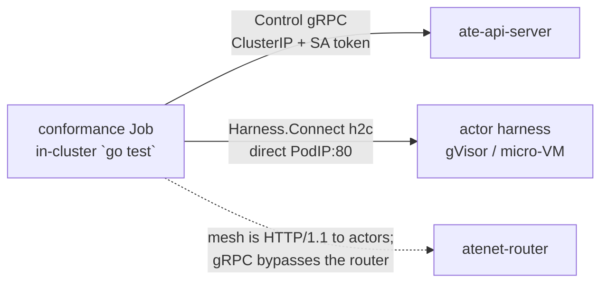

# Running on agent-substrate

`agentsessions` treats compute as a pluggable `Runtime` backend. [agent-substrate](https://github.com/agent-substrate/substrate)
(Google's OSS "actors on pre-warmed workers" runtime, with RAM+disk memory snapshots) is one such
backend. This document describes how the neutral core runs on **real** agent-substrate — proven
end-to-end in CI across both capability tiers — and how to reproduce it.

## The claim

On a fresh CI runner, in one kind cluster, `agentsessions` runs on a real `ate-system` (not a mock)
across both capability tiers, with the tamper-evident chain verifying across the snapshot boundary, the
gRPC harness transport unchanged, and the core importing zero substrate code:

- **`STATELESS_REPLAY` on gVisor:** place the echo harness, drive a turn, and replay the journal
  **byte-identically** with **zero** model invocations; the hash chain verifies.
- **`REQUIRES_MEMORY_SNAPSHOT` on a micro-VM (kata + cloud-hypervisor):** place the in-RAM
  counter, drive it to N, **suspend (memory snapshot) → restore**, and the count **continues** to N+1 —
  in-RAM state no journal replay could reconstruct, and a plain pod structurally cannot preserve.
- **Fork of a stateful session:** fan out k children from one parent checkpoint and every child
  **continues at N+1 independently**, with the parent still resumable at the same base.

All of it runs in the `substrate-conformance` job (`.github/workflows/substrate-e2e.yml`).

## Neutrality by construction

The core must not depend on substrate. The seam is a `ControlClient` interface **defined in the core**
(`runtime/substrate`), a small subset of substrate's ate-api Control gRPC:

```
CreateActor · ResumeActor{boot} · SuspendActor · DeleteActor · GetActor
```

`SnapshotCloner` is an optional second interface, also defined in the core, for the clone-from-snapshot
half of fork (`TagActorSnapshot`, `CreateActor{source_snapshot}`). Keeping it separate means a control
client that predates substrate's ActorSnapshot APIs still satisfies the base interface.

- `runtime/substrate` (in the core module) implements `api.Runtime` over that interface — no substrate
  import.
- `integrations/substrate` is a **separate Go module** with its own `go.mod` that adapts the real
  generated ate-api client to `ControlClient`. The core never imports it.
- A CI gate asserts `go list -deps ./...` on the core contains **zero** `agent-substrate` packages.

## SPI → substrate mapping

| `api.Runtime` | substrate Control |
|---|---|
| `Create` | `CreateActor` + `ResumeActor{boot:true}` (cold boot) |
| `Snapshot(EXTERNAL)` | `SuspendActor` (RAM+disk snapshot to storage, worker freed, actor SUSPENDED) |
| `Restore` | `ResumeActor{boot:false}` (restore RAM on a possibly-different worker) |
| `Fork` (stateless) | `CreateActor` + `ResumeActor{boot:true}` — a replay-fork; the journal reconstructs the child |
| `Fork` (memory) | `TagActorSnapshot` + `CreateActor{source_snapshot}` + `ResumeActor{boot:false}` — clones the parent's RAM |
| `Stop` | `SuspendActor` + `DeleteActor` |
| `Status` | `GetActor` |

`Capabilities.MemorySnapshot = true` is the tier that lets substrate host a `REQUIRES_MEMORY_SNAPSHOT`
harness a filesystem-only backend (`runtime/local`, a plain pod) refuses via `CanPlace`.

## Fork: cloning an actor from a durable snapshot

Substrate creates one immutable `ActorSnapshot` per successful `SuspendActor` and points
`Actor.latest_snapshot` at it; a new actor can be initialized from it via
`CreateActor{source_snapshot}` (substrate #529 / #570). That is the compute half of a session fork.

There is no `Fork` RPC to wait for. At this pin the `AteApi` service exposes no method that forks or
clones an actor directly; the snapshot lifecycle (`TagActorSnapshot`, `CreateActor{source_snapshot}`)
is the primitive it provides. That is the right half of the split: the compute layer copies a sandbox,
while branching the log, holding the fence, and recording lineage stay session-layer concerns this
repo owns. A session fork is therefore something to build here, not something to request upstream.

How the session layer uses it:

- **A `STATELESS_REPLAY` fork stays a replay-fork.** The parent's RAM holds nothing the journal
  lacks, so the child cold-boots and replays. The parent keeps its worker and its log is untouched.
- **A `REQUIRES_MEMORY_SNAPSHOT` fork must clone.** The parent's live state exists only in RAM and
  the harness never rebuilds it from `History` (I4), so cold-booting the child would silently produce
  a divergent branch. The Placer checkpoints the parent, records the ref in a SUSPEND event on the
  chain, and clones each child from it.
- **A fan-out shares one checkpoint.** `Fork(count: N)` snapshots the parent once and clones N
  children from that single snapshot, so the whole fleet branches from identical state.

Constraints inherited from substrate, enforced or surfaced rather than papered over:

- `CreateActor` accepts a source snapshot **only by tag**; a canonical snapshot reference is rejected
  with `FailedPrecondition`. The backend therefore tags the parent snapshot (`fork-<child-uid>`,
  atespace-scoped) before cloning.
- A clone requires the snapshot's **exact source `ActorTemplate`**, and templates with external
  volumes are rejected.
- A memory clone reflects the parent's RAM **now**, so it can only realize a fork at the log head.
  Forking a stateful session at a historical seq is refused with `ErrUnplaceable` →
  `FailedPrecondition` instead of pairing an old prefix with present-day RAM.
- A deployment predating the ActorSnapshot APIs does not satisfy the optional `SnapshotCloner`
  interface; a stateful fork there fails loudly rather than degrading to a lossy replay-fork.
- The child fan-out is all-or-nothing. If a child fails to provision, the ones already created are
  torn down and their tags released before the error returns, since their UIDs are never handed to
  the caller and an orphan would be unreachable. Teardown runs on a context detached from the
  caller's, because the likeliest cause of a mid-fan-out failure is the caller's deadline expiring.
- The parent checkpoint is not part of that rollback, because it cannot be. Once a stateful fork
  reaches the point of snapshotting, the parent is cold with a SUSPEND event on its chain whether or
  not the children go on to provision. That is a recoverable state (`Resume` brings the parent back),
  but a retry must fork at the new head rather than the original seq.
- The fork checkpoint is committed under a fence and a CAS on the seq the caller validated, so a turn
  racing the fork can never widen the children's prefix past the RAM they were cloned from. A fork
  that is *refused* takes the fence path not at all: a request that changes nothing must not
  supersede a turn in flight on the parent. A fork that proceeds does supersede it, which is the same
  semantic `Suspend` has and is over-determined anyway, since the checkpoint frees the parent's
  worker. The one rough edge is a fork that mints its fence and then aborts on the re-check: it
  supersedes the writer that beat it even though it gives up. Closing that needs a read-only fence
  accessor on `eventlog.Store` (`NewFence` is currently the only way to obtain one, and it mutates),
  which is a wider API change than this path warrants.

Two properties make the failure paths above safe, both read off substrate's suspend/delete workflows
(`cmd/ateapi/internal/controlapi/`) rather than assumed:

- **`SuspendActor` is idempotent on an already-SUSPENDED actor.** Every step after the load
  fast-forwards on its `IsComplete` check, so the call is a no-op that returns the actor still
  carrying its original `latest_snapshot`. Retrying a fork whose fan-out failed after the checkpoint
  therefore neither errors nor mints a second snapshot — it re-reads the same one.
- **A clone that never resumed is still deletable.** `CreateActor` starts an actor at
  `STATUS_SUSPENDED`, and `DeleteActor` accepts `SUSPENDED`, `CRASHED`, or `DELETING`. So the
  suspend-then-delete teardown the backend runs works on a child that failed at `ResumeActor`, and
  rollback does not strand an actor or leak its tag.

### It is not copy-on-write

`RuntimeCapabilities.CoWFork` stays **false**. Substrate restores each actor into a private per-actor
directory (cloud-hypervisor demand-pages from it), and there is no node-local snapshot cache yet
(substrate #690), so an N-way fan-out costs N full snapshot restores and the memory image dominates
the transfer. Fork is cheap in the sense that it skips re-deriving state, not in the sense that
children share pages.

The first green run measured a 3-way fan-out at **5.06s total, ~1.69s per child**, on a kind cluster
with the counter harness's small memory image.

TODO(spike): that is one snapshot size on one sandbox class, so it bounds nothing. Measuring the
curve against snapshot size, and whether a paused (node-local) parent changes it, is still open.

## Placing an actor is idempotent

`Placer.Exec` calls `Runtime.Create` on **every** turn, so on substrate `Create` resolves the actor
rather than assuming it is new — `CreateActor` rejects a repeat with `AlreadyExists`, and a cold boot
would discard whatever the actor already holds:

| Actor state | What `Create` does | Why |
|---|---|---|
| absent | `CreateActor` + `ResumeActor{boot:true}` | first placement; no durable state a boot could destroy |
| `RUNNING` | attach, return its address | the second and later turns of a session, and the first turn of a **forked child** |
| `SUSPENDED` | `ResumeActor{boot:false}` | the RAM snapshot is what must come back |

The forked-child row is the one that matters for this feature. A child's actor is created from the
parent's snapshot and resumed **before** its UID is handed out, so it is already `RUNNING` when the
first turn lands; cold-booting it there would throw away the cloned RAM the fork exists to carry, and
the harness would never rebuild it (I4). A control-client double that accepts every `CreateActor`
cannot see any of this, which is why it is asserted against a live cluster.

## The transport: direct pod-IP dial, not the mesh

The harness is a `harnesswire` gRPC server. The key finding (verified empirically on a live cluster):

- The atenet mesh (atenet-router) proxies **HTTP/1.1** to actors — its shared Envoy dynamic-forward-proxy
  cluster sets no HTTP/2 option — so a **gRPC** harness gets an Envoy `protocol error` through the router.
  All substrate demo actors are HTTP/1.1; there is no gRPC-actor path through the mesh.
- But the gVisor/micro-VM sandbox exposes the harness on the **worker pod's IP**. An **in-cluster** dial
  straight to `ActorInfo.PodIp:80` speaks h2c/gRPC cleanly, bypassing the router entirely. The
  harnesswire transport is unchanged.



Because pod IPs only route in-cluster, the conformance driver runs as a **Kubernetes Job**: it reaches
`ate-api-server` over its ClusterIP with a mounted projected ServiceAccount token (the token scheme the
api-server's `--ateapi-client-auth=token` expects), and the actor over `PodIp:80`. It needs no Kubernetes
API access — the pod IP comes from `ResumeActor`, not the k8s API.

### Reaching the actor costs two concessions

Substrate is closing the door on direct actor dials, deliberately. Two upstream changes block the
path the suite needs, and they are worked around differently because only one of them can be.

1. **A NetworkPolicy that admits only the router** (agent-substrate `e8951bca`, 2026-07-29).
   atecontroller reconciles a policy per WorkerPool whose sole ingress peer is
   `ate-system`/`app=atenet-router`. Any other dial is a dropped SYN, which surfaces as `i/o timeout`
   rather than `connection refused`. NetworkPolicy peers are additive, so
   `deploy/substrate/e2e-netpol.yaml` unions in exactly one more peer — the conformance Job — in the
   ephemeral CI cluster only.

2. **Removal of the pod-IP:80 ingress** (agent-substrate `cc858876`). It deletes the
   pod-IP:80 → actor-veth:80 DNAT and leaves an mTLS listener on `:443` that authorizes callers
   against `spiffe://cluster.local/ns/ate-system/sa/atenet-router`. No policy can work around a
   missing NAT rule, so `SUBSTRATE_REF` and `integrations/substrate/go.mod` are held at `b1bd558aba3c`,
   the last commit that still installs it. Do not bump the pin.

The pin is boxed in on both sides and the box is one commit deep: the ActorSnapshot lifecycle APIs the
fork path needs landed 2026-07-30, the ingress removal followed immediately, and the NetworkPolicy
landed 2026-07-29 — before the snapshot APIs, which is why it must be worked around rather than
pinned away. There is no commit at which fork works and direct dial is unobstructed.

### Why not just use the supported path

Because there is not one yet, for a gRPC actor. atunnel reverse-proxies HTTP/1.1 and Envoy's actor
cluster explicitly pins `Http1ProtocolOptions`, so the router cannot carry gRPC. That is
[agent-substrate#254](https://github.com/agent-substrate/substrate/issues/254), open since 2026-06-16:
"Currently only HTTP/1.1 is supported upstream of atenet, making it impossible to serve gRPC in an
actor." The workaround suggested there — gRPC transcoding over HTTP/1.1 — does not reach us, because
`Harness.Connect` is bidirectionally streaming and transcoding cannot express that.

The fix is in flight. [#484](https://github.com/agent-substrate/substrate/issues/484) proposes that
"Substrate ingress standardizes on HTTP, HTTPS, and HTTP/2 (TLS and h2c)", and #715 landed the CONNECT
machinery on 2026-08-14; what remains is dataplane work. When h2c ingress lands, the right move is to
delete both concessions above and dial the router, because upstream is unambiguous that direct actor
dialing is not a supported interface.

TODO(spike): once #484's h2c ingress lands, what does the harness transport need in order to reach an
actor through the router, and does bidirectional streaming survive the CONNECT tunnel?


## The suite (`integrations/substrate/e2e`)

The conformance suite is an ordinary Go test package, compiled with `go test -c` and run as an
in-cluster Job. A capability is a `Test` function, not a bespoke driver binary: adding one means
writing a test, not writing another `main`, another Job manifest, and another copy of the polling
shell. Tests skip unless `AGENTSESSIONS_E2E=1`, so the cheap per-PR job still compiles every line of
the suite — a driver that no longer builds fails in seconds rather than 15 minutes in.

### `TestStatelessReplayOnGVisor` — stateless-replay

Places the echo harness (`STATELESS_REPLAY`, gVisor) through the `Placer`, drives one turn over the
direct pod-IP dial, then re-dials and replays. Asserts: replay is **byte-identical**, model invocations
are **0** (I1), and the hash chain verifies. Same determinism triple as the unit conformance suite, now
over the substrate mesh.

### `TestMemorySnapshotSuspendResume` — memory continuity

Places the in-RAM counter (`harness/counteragent`, `REQUIRES_MEMORY_SNAPSHOT`) on the micro-VM class:

1. Drive to N through the `Placer` (count=N lives in **guest RAM**, not the journal).
2. `Snapshot(EXTERNAL)` → memory snapshot to storage, worker freed (`SuspendActor`), SUSPEND recorded
   on the chain.
3. Drive one more turn. The actor is SUSPENDED, so placing it **restores** rather than boots over it.

Asserts:

- **Continuity** — the counter returns **N+1**: the in-RAM state survived the snapshot round-trip.
- **No double-application** — the value is N+1, not 2N+1: the journal was **not** replayed into restored
  RAM (I4 — the counter never reconstructs state from `Start.History`).
- **Provenance** — the hash chain still verifies **across the SUSPEND boundary**.

It suspends through the `Runtime` SPI rather than `Placer.Suspend`, which also `Stop`s (deletes) the
actor — correct for a stateless session, fatal for one whose RAM is meant to come back.

### `TestForkFanOutFromMemorySnapshot` — branching a fleet from a base session

Drives the counter to N, fans out to k children in one `Placer.Fork` call, then gives each child a
turn. Every child must answer **N+1**, which is two assertions at once:

- **N+1 rather than 1** means each child really restored the parent's RAM. A child that cold-booted
  answers 1 — the silent divergence a stateful fork exists to prevent.
- **N+1 from every child**, rather than N+1, N+2, N+3 in the order they were driven, means the children
  are **independent**: they branched from identical state and evolved separately.

It also asserts each child's inherited chain verifies and its head is past the fork seq (the copied
prefix plus the `FORK` marker), then resumes the **parent** and requires it to continue at N+1 too — a
fork checkpoints its parent, it does not consume it. The fan-out is timed and logged, so a run reports
the real per-child clone cost rather than leaving it asserted.

`TestForkOfMemoryHarnessAtHistoricalSeqIsRefused` pins the honest-degradation half on real compute: a
stateful fork behind the head is refused, and the refusal leaves the parent usable.

The counter's I4 contract is harness-side and unit-tested: it is increment-only and never reads
`Start.History` (empty on a memory-restored sandbox). The neutrality contrast (`CanPlace` refuses the same
capability on `runtime/local`, accepts on substrate) is `placement`'s `TestNeutralityThroughPlacer`.

## CI

`.github/workflows/substrate-e2e.yml` runs the whole suite in one cluster, on every PR and nightly
(heavy — kind + KVM + micro-VM assets — but ~15 min, and the claims it checks are the ones no unit test
can make). A concurrency group cancels a superseded run so one push does not leave two clusters
standing. It copies substrate's own recipe: `create-kind-cluster` + `install-ate-kind`, then
`run-microvm-demo-kind` for the stateful tier (stages the kata + cloud-hypervisor asset cache and
installs the micro-VM SandboxConfig).

The suite runs in two passes against that one cluster, both through `hack/run-e2e-job.sh`: the
stateless tier first, so a break there fails before the expensive micro-VM staging, then the stateful
tier and fork. Each pass is the same image with a different `-test.run`, and the Job's full `go test -v`
output is echoed into the step, so a failure names the test and the assertion instead of surfacing an
exit code. The nested-module test and core-neutrality gate also run per-PR in
`.github/workflows/ci.yml`.

Reproduce:

```bash
gh workflow run substrate-e2e.yml --ref main
gh run watch "$(gh run list --workflow=substrate-e2e.yml --limit 1 --json databaseId --jq '.[0].databaseId')"
```

Local reproduction needs a Linux host with `/dev/kvm` (micro-VM); the recipe mirrors the CI steps against
`hack/` in an agent-substrate checkout.

## In progress

- **Placer-orchestrated suspend/resume.** `TestMemorySnapshotSuspendResume` suspends through the raw
  `Runtime` SPI because `Placer.Suspend` currently also `Stop`s (deletes) the actor, which a memory
  suspend must not. Dropping the `Stop` (Snapshot already frees the worker via `SuspendActor`) makes
  session-level suspend/resume work through the `Placer` for the general memory harness. `Placer.Fork`
  sidesteps this today by calling `Runtime.Snapshot` directly, because a fork's parent must survive as
  the branch point.
- **Fork tag lifecycle.** A fork tags the parent snapshot (`fork-<child-uid>`) so `CreateActor` can
  reference it, and a tag is a retention pin. The tag name is derived from the child session UID, so
  `Stop` releases it when the child is torn down and a failed fork releases it on the way out. A
  long-lived child therefore holds one pin on its parent's snapshot for as long as it exists, which
  is correct but means upstream snapshot GC (substrate #664) still governs the ceiling.
- **Controller-side I4.** `controller.Exec` sends the full journal as `Start.History` even on the
  post-restore turn; for the general case the controller should send empty `History` on memory-restore.
  The counter's harness-side I4 carries the stateful tier today.
