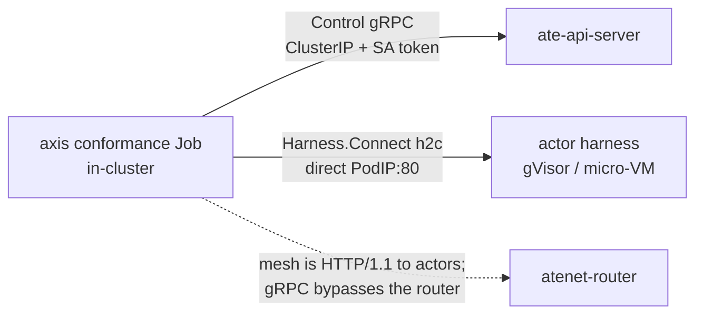

# Running on agent-substrate

`agentsessions` treats compute as a pluggable `Runtime` backend. [agent-substrate](https://github.com/agent-substrate/substrate)
(Google's OSS "actors on pre-warmed workers" runtime, with RAM+disk memory snapshots) is one such
backend. This document describes how the neutral core runs on **real** agent-substrate — proven
end-to-end in CI across both capability tiers — and how to reproduce it.

## The claim

On a fresh CI runner, in one kind cluster, `agentsessions` runs on a real `ate-system` (not a mock)
across both capability tiers, with the tamper-evident chain verifying across the snapshot boundary, the
gRPC harness transport unchanged, and the core importing zero substrate code:

- **Axis 1 — `STATELESS_REPLAY` on gVisor:** place the echo harness, drive a turn, and replay the journal
  **byte-identically** with **zero** model invocations; the hash chain verifies.
- **Axis 2 — `REQUIRES_MEMORY_SNAPSHOT` on a micro-VM (kata + cloud-hypervisor):** place the in-RAM
  counter, drive it to N, **suspend (memory snapshot) → restore**, and the count **continues** to N+1 —
  in-RAM state no journal replay could reconstruct, and a plain pod structurally cannot preserve.

Both run in the `substrate-conformance` job (`.github/workflows/substrate-e2e.yml`).

## Neutrality by construction

The core must not depend on substrate. The seam is a `ControlClient` interface **defined in the core**
(`runtime/substrate`), a small subset of substrate's ate-api Control gRPC:

```
CreateActor · ResumeActor{boot} · SuspendActor · DeleteActor · GetActor
```

- `runtime/substrate` (in the core module) implements `api.Runtime` over that interface — no substrate
  import.
- `integrations/substrate` is a **separate Go module** with its own `go.mod` that adapts the real
  generated ate-api client to `ControlClient`. The core never imports it.
- A CI gate asserts `go list -deps ./...` on the core contains **zero** `agent-substrate` packages.

## SPI → substrate mapping

| `api.Runtime` | substrate Control |
|---|---|
| `Create` | `CreateActor` + `ResumeActor{boot:true}` (cold boot) |
| `Snapshot(EXTERNAL)` | `SuspendActor` (RAM+disk snapshot to storage, worker freed, actor SUSPENDED) |
| `Restore` | `ResumeActor{boot:false}` (restore RAM on a possibly-different worker) |
| `Stop` | `SuspendActor` + `DeleteActor` |
| `Status` | `GetActor` |

`Capabilities.MemorySnapshot = true` is the tier that lets substrate host a `REQUIRES_MEMORY_SNAPSHOT`
harness a filesystem-only backend (`runtime/local`, a plain pod) refuses via `CanPlace`.

## The transport: direct pod-IP dial, not the mesh

The harness is a `harnesswire` gRPC server. The key finding (verified empirically on a live cluster):

- The atenet mesh (atenet-router) proxies **HTTP/1.1** to actors — its shared Envoy dynamic-forward-proxy
  cluster sets no HTTP/2 option — so a **gRPC** harness gets an Envoy `protocol error` through the router.
  All substrate demo actors are HTTP/1.1; there is no gRPC-actor path through the mesh.
- But the gVisor/micro-VM sandbox exposes the harness on the **worker pod's IP**. An **in-cluster** dial
  straight to `ActorInfo.PodIp:80` speaks h2c/gRPC cleanly, bypassing the router entirely — the same
  approach Google's `ax` uses (`internal/harness/substrate`). The harnesswire transport is unchanged.



Because pod IPs only route in-cluster, the conformance driver runs as a **Kubernetes Job**: it reaches
`ate-api-server` over its ClusterIP with a mounted projected ServiceAccount token (the token scheme the
api-server's `--ateapi-client-auth=token` expects), and the actor over `PodIp:80`. It needs no Kubernetes
API access — the pod IP comes from `ResumeActor`, not the k8s API.

## Axis 1 — stateless-replay (`integrations/substrate/cmd/axis1`)

Places the echo harness (`STATELESS_REPLAY`, gVisor) via the `Runtime` SPI, drives one turn over the
direct pod-IP dial, then re-dials and replays. Asserts: replay is **byte-identical**, model invocations
are **0** (I1), and the hash chain verifies. Same determinism triple as the unit conformance suite, now
over the substrate mesh.

## Axis 2 — memory continuity (`integrations/substrate/cmd/axis2`)

Places the in-RAM counter (`harness/counteragent`, `REQUIRES_MEMORY_SNAPSHOT`) on the micro-VM class,
then drives the Runtime SPI directly:

1. `Create` → drive to N (count=N lives in **guest RAM**, not the journal).
2. `Snapshot(EXTERNAL)` → memory snapshot to storage, worker freed (`SuspendActor`).
3. `Restore` → `ResumeActor{boot:false}` restores guest RAM on a fresh worker.
4. Drive one more turn under a fresh fence.

Asserts four properties:

- **Continuity** — the counter returns **N+1**: the in-RAM state survived the snapshot round-trip.
- **No double-application** — the value is N+1, not 2N+1: the journal was **not** replayed into restored
  RAM (I4 — the counter never reconstructs state from `Start.History`).
- **Provenance** — the hash chain still verifies **across the SUSPEND boundary**.
- **Fresh fence** — the post-restore turn extends the chain under a new fence, superseding the suspended
  incarnation.

The counter's I4 contract is harness-side and unit-tested: it is increment-only and never reads
`Start.History` (empty on a memory-restored sandbox). The neutrality contrast (`CanPlace` refuses the same
capability on `runtime/local`, accepts on substrate) is `placement`'s `TestNeutralityThroughPlacer`.

## CI

`.github/workflows/substrate-e2e.yml` runs both axes in one cluster, on every PR and nightly (heavy —
kind + KVM + micro-VM assets — but ~15 min, and the claims it checks are the ones no unit test can
make). A concurrency group cancels a superseded run so one push does not leave two clusters standing.
It copies substrate's own recipe: `create-kind-cluster` + `install-ate-kind`, then for axis 2
`run-microvm-demo-kind` (stages the kata + cloud-hypervisor asset cache and installs the micro-VM
SandboxConfig). Each axis builds its driver with `ko`, runs it as a Job, and fails the step unless the
Job succeeds. The nested-module test and core-neutrality gate also run per-PR in
`.github/workflows/ci.yml`.

Reproduce:

```bash
gh workflow run substrate-e2e.yml --ref main
gh run watch "$(gh run list --workflow=substrate-e2e.yml --limit 1 --json databaseId --jq '.[0].databaseId')"
```

Local reproduction needs a Linux host with `/dev/kvm` (micro-VM); the recipe mirrors the CI steps against
`hack/` in an agent-substrate checkout.

## In progress

- **Placer-orchestrated suspend/resume.** The axis-2 driver exercises the raw `Runtime` SPI because
  `Placer.Suspend` currently also `Stop`s (deletes) the actor, which a memory suspend must not. Dropping
  the `Stop` (Snapshot already frees the worker via `SuspendActor`) makes session-level suspend/resume work
  through the `Placer` for the general memory harness.
- **Controller-side I4.** `controller.Advance` sends the full journal as `Start.History` even on the
  post-restore turn; for the general case the controller should send empty `History` on memory-restore.
  The counter's harness-side I4 carries axis-2 today.
