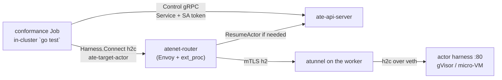

# Running on agent-substrate

`agentsessions` treats compute as a pluggable `Runtime` backend. [agent-substrate](https://github.com/agent-substrate/substrate)
(Google's OSS "actors on pre-warmed workers" runtime, with RAM+disk memory snapshots) is one such
backend. This document describes how the neutral core runs on **real** agent-substrate — proven
end-to-end in CI across both capability tiers — and how to reproduce it.

## The claim

On a fresh CI runner, in one kind cluster, `agentsessions` runs on a real `ate-system` (not a mock)
across both capability tiers, with the tamper-evident chain verifying across the snapshot boundary, the
gRPC harness transport unchanged, and the core importing zero substrate code:

- **`STATELESS_REPLAY` on gVisor:** place the echo harness, drive a turn, and replay the journal
  **byte-identically** with **zero** model invocations; the hash chain verifies.
- **`REQUIRES_MEMORY_SNAPSHOT` on a micro-VM (kata + cloud-hypervisor):** place the in-RAM
  counter, drive it to N, **suspend (memory snapshot) → restore**, and the count **continues** to N+1 —
  in-RAM state no journal replay could reconstruct, and a plain pod structurally cannot preserve.
- **Fork of a stateful session:** fan out k children from one parent checkpoint and every child
  **continues at N+1 independently**, with the parent still resumable at the same base.

All of it runs in the `substrate-conformance` job (`.github/workflows/substrate-e2e.yml`).

## Neutrality by construction

The core must not depend on substrate. The seam is a `ControlClient` interface **defined in the core**
(`runtime/substrate`), a small subset of substrate's ate-api Control gRPC:

```
CreateActor · ResumeActor · SuspendActor · DeleteActor · GetActor
```

`SnapshotCloner` is an optional second interface, also defined in the core, for the clone-from-snapshot
half of fork (`CreateTag`, `CreateActor{source_tag}`, `DeleteTag`). Keeping it separate means a control
client without substrate's Tag APIs still satisfies the base interface.

- `runtime/substrate` (in the core module) implements `api.Runtime` over that interface — no substrate
  import.
- `integrations/substrate` is a **separate Go module** with its own `go.mod` that adapts the real
  generated ate-api client to `ControlClient`. The core never imports it.
- A CI gate asserts `go list -deps ./...` on the core contains **zero** `agent-substrate` packages.

## SPI → substrate mapping

| `api.Runtime` | substrate Control |
|---|---|
| `Create` | `CreateActor` + `ResumeActor` (starts from the template's golden snapshot, or cold-boots) |
| `Snapshot(EXTERNAL)` | `SuspendActor` (RAM+disk snapshot to storage, worker freed, actor SUSPENDED) |
| `Restore` | `ResumeActor` (restores the actor's own snapshot on a possibly-different worker) |
| `Fork` (stateless) | `CreateActor` + `ResumeActor` — a replay-fork; the journal reconstructs the child |
| `Fork` (memory) | `CreateTag{source_actor}` + `CreateActor{source_tag}` + `ResumeActor` — clones the parent's RAM |

There is no per-resume boot flag (substrate removed `ResumeActorRequest.boot`). Substrate picks the
source itself: the actor's own snapshot, else the template's golden snapshot, else a cold boot of the
template spec. That is enough for `STATELESS_REPLAY`: a new actor has no snapshot of its own, and the
golden snapshot is the harness captured right after it became ready, before any session touched it,
so it carries no session state. A template that must cold-boot on every resume would set
`snapshotConfig.onCommit: DATA` instead; nothing here needs that.
| `Stop` | `SuspendActor` + `DeleteActor` |
| `Status` | `GetActor` |

`Capabilities.MemorySnapshot = true` is the tier that lets substrate host a `REQUIRES_MEMORY_SNAPSHOT`
harness a filesystem-only backend (`runtime/local`, a plain pod) refuses via `CanPlace`.

## Fork: cloning an actor from a durable snapshot

Every successful `SuspendActor` leaves the actor holding a new external snapshot
(`Actor.status.external_snapshot`). `CreateTag{source_actor}` copies the snapshot a SUSPENDED actor
holds into tag-owned storage, and `CreateActor{source_tag}` seeds a new actor from that copy. That is
the compute half of a session fork.

There is no `Fork` RPC to wait for. The Control service exposes no method that forks or clones an
actor directly; tags are the primitive it provides. That is the right half of the split: the compute layer copies a sandbox,
while branching the log, holding the fence, and recording lineage stay session-layer concerns this
repo owns. A session fork is therefore something to build here, not something to request upstream.

How the session layer uses it:

- **A `STATELESS_REPLAY` fork stays a replay-fork.** The parent's RAM holds nothing the journal
  lacks, so the child cold-boots and replays. The parent keeps its worker and its log is untouched.
- **A `REQUIRES_MEMORY_SNAPSHOT` fork must clone.** The parent's live state exists only in RAM and
  the harness never rebuilds it from `History` (I4), so cold-booting the child would silently produce
  a divergent branch. The Placer checkpoints the parent, records the ref in a SUSPEND event on the
  chain, and clones each child from it.
- **A fan-out shares one checkpoint.** `Fork(count: N)` snapshots the parent once and clones N
  children from that single snapshot, so the whole fleet branches from identical state.

Constraints inherited from substrate, enforced or surfaced rather than papered over:

- `CreateActor` seeds an actor **only from a tag**, and a tag names the suspended parent **actor**,
  capturing whichever snapshot it holds when the tag is created. The router resumes an actor on any
  request addressed to it, so the parent can be woken and suspended again between the fork's
  checkpoint and its tag. The backend checks on both sides of the tag that the parent is still
  SUSPENDED holding the snapshot the fork took (a suspend always writes a new one), and otherwise
  deletes the tag and fails with `ErrSnapshotSuperseded`.
- The backend takes one tag per child (`fork-<child-uid>`, atespace-scoped). Each tag owns a full
  copy of the snapshot, and a child borrows its tag's copy until its own first suspend, so the tag
  lives as long as the child and `Stop` deletes it after deleting the child.
- A clone requires the snapshot's **exact source `ActorTemplate`**, and templates with external
  volumes are rejected.
- A memory clone reflects the parent's RAM **now**, so it can only realize a fork at the log head.
  Forking a stateful session at a historical seq is refused with `ErrUnplaceable` →
  `FailedPrecondition` instead of pairing an old prefix with present-day RAM.
- A control client without the Tag APIs does not satisfy the optional `SnapshotCloner` interface; a
  stateful fork there fails loudly rather than degrading to a lossy replay-fork.
- The child fan-out is all-or-nothing. If a child fails to provision, the ones already created are
  torn down and their tags released before the error returns, since their UIDs are never handed to
  the caller and an orphan would be unreachable. Teardown runs on a context detached from the
  caller's, because the likeliest cause of a mid-fan-out failure is the caller's deadline expiring.
- The parent checkpoint is not part of that rollback, because it cannot be. Once a stateful fork
  reaches the point of snapshotting, the parent is cold with a SUSPEND event on its chain whether or
  not the children go on to provision. That is a recoverable state (`Resume` brings the parent back),
  but a retry must fork at the new head rather than the original seq.
- The fork checkpoint is committed under a fence and a CAS on the seq the caller validated, so a turn
  racing the fork can never widen the children's prefix past the RAM they were cloned from. A fork
  that is *refused* takes the fence path not at all: a request that changes nothing must not
  supersede a turn in flight on the parent. A fork that proceeds does supersede it, since the
  checkpoint frees the parent's worker. Unlike `Suspend`, `Fork` is not covered by the Registry's
  session guard; `Suspend` rejects overlap instead of interrupting the running turn. The one rough
  edge is a fork that mints its fence and then aborts on the re-check: it
  supersedes the writer that beat it even though it gives up. Closing that needs a read-only fence
  accessor on `eventlog.Store` (`NewFence` is currently the only way to obtain one, and it mutates),
  which is a wider API change than this path warrants.

Two properties make the failure paths above safe, both read off substrate's suspend/delete workflows
(`cmd/ateapi/internal/controlapi/`) rather than assumed:

- **`SuspendActor` is idempotent on an already-SUSPENDED actor.** Every step after the load
  fast-forwards on its `IsComplete` check, so the call is a no-op that returns the actor still
  carrying its original external snapshot. Retrying a fork whose fan-out failed after the checkpoint
  therefore neither errors nor mints a second snapshot — it re-reads the same one.
- **A clone that never resumed is still deletable.** `CreateActor` starts an actor at
  `ACTOR_STATE_SUSPENDED`, and `DeleteActor` accepts `SUSPENDED`, `CRASHED`, or `DELETING`. So the
  suspend-then-delete teardown the backend runs works on a child that failed at `ResumeActor`, and
  rollback does not strand an actor or leak its tag.

### It is not copy-on-write

`RuntimeCapabilities.CoWFork` stays **false**. Each fork tag copies the parent's snapshot in object
storage, and substrate restores each actor into a private per-actor directory, so an N-way fan-out
costs N snapshot copies and N full restores, and the memory image dominates the transfer. Fork is cheap in the sense that it skips re-deriving state, not in the sense that
children share pages.

The first green run, at the earlier substrate pin where a tag did not copy the snapshot, measured a
3-way fan-out at **5.06s total, ~1.69s per child**, on a kind cluster with the counter harness's
small memory image. The suite logs the fan-out time on every run.

Read that as an existence proof, not a bound: it is one snapshot size on one sandbox class. How
the cost scales with snapshot size, and whether a paused (node-local) parent changes it, has not
been measured.

## Placing an actor is idempotent

`Placer.Exec` calls `Runtime.Create` on **every** turn, so on substrate `Create` resolves the actor
rather than assuming it is new — `CreateActor` rejects a repeat with `AlreadyExists`, and a cold boot
would discard whatever the actor already holds:

| Actor state | What `Create` does | Why |
|---|---|---|
| absent | `CreateActor` + `ResumeActor` | first placement; the actor starts from the template's golden snapshot, which holds no session state |
| `RUNNING` | attach, return its incarnation | the second and later turns of a session, and the first turn of a **forked child** |
| `SUSPENDED` | `ResumeActor` | restores the actor's own snapshot: the RAM is what must come back |

The forked-child row is the one that matters for this feature. A child's actor is created from the
parent's snapshot and resumed **before** its UID is handed out, so it is already `RUNNING` when the
first turn lands; cold-booting it there would throw away the cloned RAM the fork exists to carry, and
the harness would never rebuild it (I4). A control-client double that accepts every `CreateActor`
cannot see any of this, which is why it is asserted against a live cluster.

### Suspend and Resume failure boundaries

An `Exec` after `Placer.Suspend` does not require an explicit `Placer.Resume`: `Create` resumes the
SUSPENDED actor, which restores its own snapshot, then the controller records the new execution. This path preserves
the actor's captured state but does not append a RESUME lifecycle marker.

`Placer.Resume` restores compute before dialing the harness, minting a fence, recovering any interrupted
turn, and appending RESUME. If a step after `Restore` fails, the actor may already be RUNNING while the
journal's last lifecycle marker is still SUSPEND. There is no automatic re-snapshot on this failure.
A later successful `Suspend` checkpoints the running actor and records a new SUSPEND; a later successful
`Exec` attaches to it and records a new execution without a RESUME marker. Either reconciles the
recorded compute state with the actor; neither rolls back effects from a failed interrupted turn.

## The transport: harnesswire through atenet-router

The harness is a `harnesswire` gRPC server on port 80 in the actor. The host reaches it the only way
current substrate supports: through `atenet-router`, the cluster's actor ingress.

- Every substrate incarnation carries the router address (`atenet-router.ate-system.svc:80` by default,
  `substrate.WithRouter` to override) and `CallMetadata` of `ate-target-actor: <atespace>/<actor>`.
  The Placer's dialer attaches that metadata to every call. The router ignores the host and
  authority; the header alone selects the actor (substrate `internal/atenet/headers.go`).
- The router accepts h2c and carries gRPC unary, server-streaming and bidi calls, trailers included,
  to the actor (substrate #1183; upstream e2e `TestIngressGRPC`). It resumes a suspended actor on
  request, then forwards over mTLS to the worker's atunnel, which checks the actor is assigned to it
  and proxies to port 80 over the actor's private veth.
- Substrate removed the worker pod-IP:80 ingress on purpose (substrate #559), so there is no direct
  path to fall back on, and the conformance Job needs no NetworkPolicy exception.


```mermaid
flowchart LR
  job["conformance Job<br/>in-cluster `go test`"]
  api["ate-api-server"]
  router["atenet-router<br/>(Envoy + ext_proc)"]
  tunnel["atunnel on the worker"]
  actor["actor harness :80<br/>gVisor / micro-VM"]

  job -->|"Control gRPC<br/>Service + SA token"| api
  job -->|"Harness.Connect h2c<br/>ate-target-actor"| router
  router -->|"ResumeActor if needed"| api
  router -->|"mTLS h2"| tunnel
  tunnel -->|"h2c over veth"| actor
```

Limits that come with the router, measured or read rather than assumed:

- **Route timeout.** The router bounds streams by `--route-timeout` (5m by default, one global value)
  plus a 30s idle timeout. `TestHarnessStreamIdlePastRouteTimeout` holds a Connect stream idle, as a
  turn parked on a slow model call does. On kind at `362637f9` the router reset it after **5m30s**:
  a pending `Recv` got `Internal` "stream terminated by RST_STREAM with error code: INTERNAL_ERROR".
  Through the Placer, which does not read while the host's model call runs, the turn failed only when
  the host sent its late reply, with a bare `EOF`. A turn that can run past 5m30s needs the router's
  timeout raised until substrate offers a per-route or streaming timeout.
- **Checkpoint drain.** Before it snapshots, the worker waits for the actor's in-flight requests to
  finish, and an idle open Connect stream is one of them. On kind at `362637f9`, `SuspendActor` under
  such a stream took **5m30s**: it waited for the router to reset the stream. `Placer.Suspend`
  therefore never checkpoints under a turn it knows of: while an `Exec` or `Resume` of the session
  runs, it is refused with `ErrSessionBusy` (ABORTED), and once the turn has returned its stream is
  closed. A stateful `Fork`, which supersedes the running turn instead, closes the parent's harness
  streams before it checkpoints. `TestSuspendUnderAnIdleHarnessStream` checks the Suspend half on a
  live cluster. Both cover turns this process drives; a turn driven by another host is fenced by the
  log, but its stream stays open until it next touches the log and can still stall a checkpoint.
- **No caller authentication.** The router does not check who is calling before it resumes an actor
  and proxies to it, so any pod that can reach it can drive any harness. See
  [security.md](security.md).

## The suite (`integrations/substrate/e2e`)

The conformance suite is an ordinary Go test package, compiled with `go test -c` and run as an
in-cluster Job. A capability is a `Test` function, not a bespoke driver binary: adding one means
writing a test, not writing another `main`, another Job manifest, and another copy of the polling
shell. Tests skip unless `AGENTSESSIONS_E2E=1`, so the cheap per-PR job still compiles every line of
the suite — a driver that no longer builds fails in seconds rather than 15 minutes in.

### `TestStatelessReplayOnGVisor` — stateless-replay

Places the echo harness (`STATELESS_REPLAY`, gVisor) through the `Placer`, drives one turn through
the router, then re-dials and replays. Asserts: replay is **byte-identical**, model invocations
are **0** (I1), and the hash chain verifies. Same determinism triple as the unit conformance suite, now
through the substrate router.

### `TestSessionSuspendResumeOnGVisor` — session-level stateless suspension

Places the echo harness through the `Placer`, executes a turn, calls `Placer.Suspend` and explicit
`Placer.Resume`, then executes another turn. The recorded snapshot retains the actor handle required
by Restore, and both lifecycle markers and subsequent output remain on a valid hash chain. This
regression is selected alongside stateless replay in the gVisor CI pass.

Cold suspension is not teardown: `Snapshot(EXTERNAL)` releases the worker and keeps the actor
SUSPENDED; `Stop` deletes it. Calling Stop after the snapshot would make explicit Resume fail with
NotFound, even for a stateless harness.

### `TestMemorySnapshotSuspendResume` — memory continuity

Places the in-RAM counter (`harness/counteragent`, `REQUIRES_MEMORY_SNAPSHOT`) on the micro-VM class:

1. Drive to N through the `Placer` (count=N lives in **guest RAM**, not the journal).
2. `Placer.Suspend` → `Snapshot(EXTERNAL)`: memory snapshot to storage, worker freed (`SuspendActor`),
   actor retained, and SUSPEND recorded on the chain.
3. Explicit `Placer.Resume` restores the actor and records RESUME.
4. Drive one more turn through the Placer without booting over the restored RAM.

Asserts:

- **Continuity** — the counter returns **N+1**: the in-RAM state survived the snapshot round-trip.
- **No double-application** — the value is N+1, not 2N+1: the journal was **not** replayed into restored
  RAM (I4 — the counter never reconstructs state from `Start.History`).
- **Provenance** — the hash chain still verifies **across the SUSPEND and RESUME boundary**.

Both lifecycle operations use the Placer, rather than bypassing it with a raw Runtime snapshot and
manually appended SUSPEND. Neither operation tears down the actor needed to restore its RAM.

### `TestForkFanOutFromMemorySnapshot` — branching a fleet from a base session

Drives the counter to N, fans out to k children in one `Placer.Fork` call, then gives each child a
turn. Every child must answer **N+1**, which is two assertions at once:

- **N+1 rather than 1** means each child really restored the parent's RAM. A child that cold-booted
  answers 1 — the silent divergence a stateful fork exists to prevent.
- **N+1 from every child**, rather than N+1, N+2, N+3 in the order they were driven, means the children
  are **independent**: they branched from identical state and evolved separately.

It also asserts each child's inherited chain verifies and its head is past the fork seq (the copied
prefix plus the `FORK` marker), then resumes the **parent** and requires it to continue at N+1 too — a
fork checkpoints its parent, it does not consume it. The fan-out is timed and logged, so a run reports
the real per-child clone cost rather than leaving it asserted.

`TestForkOfMemoryHarnessAtHistoricalSeqIsRefused` pins the honest-degradation half on real compute: a
stateful fork behind the head is refused, and the refusal leaves the parent usable.

The counter's I4 contract is harness-side and unit-tested: it is increment-only and never reads
`Start.History` (empty on a memory-restored sandbox). The neutrality contrast (`CanPlace` refuses the same
capability on `runtime/local`, accepts on substrate) is `placement`'s `TestNeutralityThroughPlacer`.

## CI

`.github/workflows/substrate-e2e.yml` runs the whole suite in one cluster, on every PR and nightly
(heavy — kind + KVM + micro-VM assets — but ~15 min, and the claims it checks are the ones no unit test
can make). A concurrency group cancels a superseded run so one push does not leave two clusters
standing. It copies substrate's own recipe: `create-kind-cluster` + `install-ate-kind`, then
`run-microvm-demo-kind` for the stateful tier (stages the kata + cloud-hypervisor asset cache and
installs the micro-VM SandboxConfig).

The workflow applies only the WorkerPools (`deploy/substrate/*-workerpool.yaml`). ActorTemplates are
substrate API resources in an atespace, so the suite creates its own through Control with the harness
image the workflow built (`HARNESS_IMAGE`) and waits for each golden snapshot.

The suite runs in three passes against that one cluster, all through `hack/run-e2e-job.sh`: the
stateless tier and the suspend-under-an-idle-stream check first, so a break there fails before the
expensive micro-VM staging, then the idle-stream route-timeout check, then the stateful tier and fork. Each pass is the same image with a different `-test.run`, and the Job's full `go test -v`
output is echoed into the step, so a failure names the test and the assertion instead of surfacing an
exit code. The nested-module test and core-neutrality gate also run per-PR in
`.github/workflows/ci.yml`.

Reproduce:

```bash
gh workflow run substrate-e2e.yml --ref main
gh run watch "$(gh run list --workflow=substrate-e2e.yml --limit 1 --json databaseId --jq '.[0].databaseId')"
```

The micro-VM tier needs a Linux host with `/dev/kvm`; the recipe mirrors the CI steps against `hack/` in
an agent-substrate checkout. On a host without KVM (an arm64 Mac running kind), apply
`deploy/substrate/counter-gvisor-workerpool.yaml` and run with `COUNTER_SANDBOX_CLASS=gvisor`: a gVisor
FULL checkpoint also captures memory, so the stateful and fork tests exercise the same paths on gVisor.
`KIND_CLUSTER_NAME` selects the cluster for the `hack/` scripts.

### Verification boundary

The session-level stateless regression and explicit memory Resume are selected by the respective
live CI passes. Ordinary local `go test` runs compile them but skip them unless `AGENTSESSIONS_E2E=1`;
a skipped test is not live verification.

Root placement tests separately exercise a lifecycle-faithful control fake: deletion removes actors,
missing-actor Resume returns NotFound, Suspend retains established fork-child pins, and destructive
Stop removes only the child's own pin while its sibling remains usable. Suspend followed by Exec
without Resume restores through `Create`, which resumes the actor from its own snapshot, preserves the fake's counter, and journals no
RESUME marker. These tests prove orchestration and retention behavior, not real RAM snapshot continuity.

## In progress

- **Fork tag lifecycle.** A fork tags the parent (`fork-<child-uid>`) so `CreateActor` can seed the
  child from it, and each tag owns a full copy of the parent's snapshot. The tag name is derived from
  the child session UID, so `Stop` deletes it after the child and a failed fork deletes it on the way
  out. A child's tag is kept indefinitely: `DeleteSession` is unimplemented and no session teardown
  calls `Stop`. Suspended actors are likewise retained indefinitely. Operators must reclaim actors
  and fork tags directly in Substrate; there is no automatic retention deadline. One tag per fan-out
  instead of per child would save N-1 copies, but a shared tag can only be deleted once every child
  has suspended at least once.
- **Controller-side I4.** `controller.Exec` sends the full journal as `Start.History` even on the
  post-restore turn; for the general case the controller should send empty `History` on memory-restore.
  The counter's harness-side I4 carries the stateful tier today.
